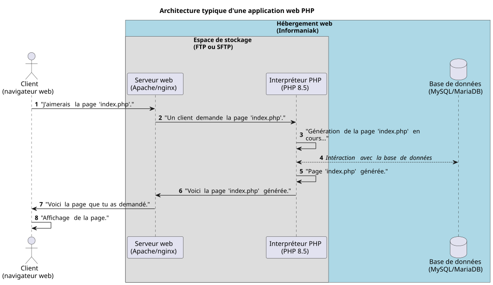

<!--
theme: custom-marp-theme
size: 16:9
paginate: true
author: L. Delafontaine, avec l'aide de GitHub Copilot
title: HEIG-VD ProgServ2 Course - Rappels sur PHP
description: Rappels sur PHP pour le cours ProgServ2 enseigné à la HEIG-VD, Suisse
url: https://heig-vd-progserv-course.github.io/heig-vd-progserv2-course/01-contenus-du-cours/02-rappels-sur-php/presentation.html
header: "[**Rappels sur PHP**](https://github.com/heig-vd-progserv-course/heig-vd-progserv2-course/blob/main/01-contenus-du-cours/02-rappels-sur-php/README.md)"
footer: '[**HEIG-VD**](https://heig-vd.ch) - [ProgServ2 2025-2026](https://github.com/heig-vd-progserv-course/heig-vd-progserv2-course) - [CC BY-SA 4.0](https://github.com/heig-vd-progserv-course/heig-vd-progserv2-course/blob/main/LICENSE.md)'
headingDivider: 6
math: mathjax
-->

# Rappels sur PHP

<!--
_class: lead
_paginate: false
-->

[ `github.com/heig-vd-progserv-course/heig-vd-progserv2-course`](https://github.com/heig-vd-progserv-course/heig-vd-progserv2-course)

[Visualiser le contenu complet sur GitHub][contenu-complet].

<small>L. Delafontaine, avec l'aide de
[GitHub Copilot](https://github.com/features/copilot).</small>

<small>Ce travail est sous licence [CC BY-SA 4.0][license].</small>

![bg opacity:0.1][illustration-principale]

## Retrouvez le contenu complet de cette présentation sur GitHub

<!-- _class: lead -->

_Cette présentation est un résumé du contenu complet disponible sur GitHub._

_Pour plus de détails, retrouvez le contenu complet [ici][contenu-complet] ou en
cliquant sur l'en-tête de ce document._

## Objectifs

- Rappeler les concepts de base de PHP.

![bg right:40%][illustration-objectifs]

## Architecture client-serveur (1/2)

La plupart des applications web modernes reposent sur une architecture dite
_"client-serveur"_ :

1. Un client (navigateur web) envoie une requête à un serveur.
2. Le serveur traite la requête.
3. Le serveur renvoie une réponse aux différents clients.
4. Le client affiche le résultat de la requête.

**PHP repose sur cette même architecture.**

## Architecture client-serveur (2/2)

PHP fonctionne grâce aux outils suivants :

- Un serveur web pour gérer les requêtes HTTP.
- Un interpréteur PHP pour exécuter le code PHP.
- Une base de données pour stocker les données.
- Un espace de stockage pour stocker les fichiers de l'application.
- Un navigateur web (le client) pour effectuer les requêtes et afficher les
  résultats des requêtes.

---



### Navigateur web (client)

- Permet à l'utilisateur d'interagir avec l'application web.
- Envoie des requêtes HTTP au serveur web.
- Affiche les réponses du serveur web (HTML, CSS, JavaScript, images, etc.).
- **Ne comprend pas le code PHP, juste le résultat de la requête !**


### Serveur web

- Gère les requêtes HTTP.
- Distribue les ressources (fichiers HTML, CSS, JavaScript, images, etc.).
- Exemples : Apache, Nginx.
- Jusqu'à présent localement : `php -S 0.0.0.0:8080`.
- Dans un contexte professionnel : Apache ou Nginx (ex. Infomaniak).


### Interpréteur PHP

- Exécute le code PHP.
- Génère du contenu dynamique.
- Communique avec la base de données.


### Base de données

- Stocke les données de l'application.
- Exemples : MySQL/MariaDB, PostgreSQL, SQLite.


### Espace de stockage

- Stocke les fichiers de l'application.
- Exemples : FTP, SFTP, stockage en ligne.
- Les outils tels que FileZilla (Windows/Linux) ou Cyberduck (macOS) permettent
  de transférer les fichiers vers le serveur web.


### Hébergement (1/2)

- Services pour héberger une application web PHP.
- Fournit le serveur web, l'interpréteur PHP, la base de données et l'espace de
  stockage.
- Exemples : Infomaniak, OVH, AWS, DigitalOcean.


### Hébergement (2/2)

Dans ce cours, nous allons utiliser Infomaniak :

- Hébergeur suisse populaire.
- Offre des services adaptés aux applications PHP.
- Propose un programme étudiant pour des hébergements gratuits.


## Variables (1/2)

- PHP est un language de programmation à typage dynamique.
- Il n'y a pas besoin de déclarer le type de données d'une variable.
- Le type de données d'une variable est déterminé par la valeur qui lui est
  assignée.

![bg right:40%][illustration-variables]

## Variables (2/2)

- Une variable commence toujours par le symbole `$` en PHP.
- Une valeur lui est affectée (= donnée) avec l'opérateur `=`.
- Une variable peut changer de type en cours d'exécution.

```php
<?php
$variable = "Hello";                        // string
$variable = 42;                             // int
$variable = 3.14;                           // float
$variable = true;                           // bool
$variable = [true, 2, "3", 4 => [5, 6, 7]]; // array
$variable = null;                           // null
```

## Constantes (1/2)

- Les constantes sont des valeurs qui ne peuvent pas être modifiées.
- Les constantes sont déclarées avec le mot-clé `const` ou avec la fonction
  `define()`.
- La convention veut que les constantes soient écrites en majuscules.

![bg right:40%][illustration-constantes]

## Constantes (2/2)

```php
<?php
define("PI", 3.14159); // Définition d'une constante
const EULER = 2.71828; // Définition d'une constante

echo PI;    // Affiche 3.14159
echo EULER; // Affiche 2.71828

PI = 3.14; // Erreur : les constantes ne peuvent pas être modifiées
```

## Opérateurs (1/2)

- Permet d'effectuer des opérations sur des variables et des valeurs.
- Opérateurs arithmétiques : `+`, `-`, `*`, `/`, `%` (modulo)
- Opérateurs de comparaison : `==` (égal), `!=` (différent), `>` (supérieur),
  `<` (inférieur)
- Opérateurs logiques : `&&` (et), `||` (ou), `!` (non/inversion)

![bg right:40%][illustration-operateurs]

## Opérateurs (2/2)

```php
<?php

$a = 10;
$b = 5;
$c = 15;
$d = 15;

// L'opérateur `===` permet de vérifier la valeur et le type (à préférer).
if ($a > $b && $c === $d) {
  echo "Condition met!";
} else {
  echo "Condition not met!";
}
```

## Structures conditionnelles (1/4)

- Permettent de contrôler le flux d'exécution d'un programme.
- Utilisent les opérateurs de comparaison et logiques.
- Elles se composent de `if`, `else`, `elseif` et `switch`.

![bg right:40%][illustration-structures-conditionnelles]

## Structures conditionnelles (2/4)

```php
<?php
$age = 20;

if ($age < 18) {
    echo "You are a minor.";
} elseif ($age >= 18 && $age < 65) {
    echo "You are an adult.";
} else {
    echo "You are a senior.";
}
```

## Structures conditionnelles (3/4)

<div class="two-columns">
<div>

```php
<?php
$day = "Monday";

switch ($day) {
    case "Monday":
        echo "It's Monday!";
        break;
    case "Tuesday":
        echo "It's Tuesday!";
        break;
    case "Wednesday":
        echo "It's Wednesday!";
        break;
// ...
```

</div>
<div>

```php
// ...
    case "Thursday":
        echo "It's Thursday!";
        break;
    case "Friday":
        echo "It's Friday!";
        break;
    case "Saturday":
        echo "It's Saturday!";
        break;
    case "Sunday":
        echo "It's Sunday!";
        break;
}
```

</div>
</div>

## Structures conditionnelles (4/4)

<div class="two-columns">
<div>

```php
<?php
$day = "Monday";

switch ($day) {
    case "Monday":
    case "Tuesday":
    case "Wednesday":
    case "Thursday":
    case "Friday":
        echo "It's a weekday!";
        break;
// ...
```

</div>
<div>

```php
// ...
    case "Saturday":
    case "Sunday":
        echo "It's the weekend!";
        break;
    default:
        echo "Invalid day!";
        break;
}
```

</div>
</div>

## Tableaux et boucles

<!-- _class: lead -->

### Tableaux (1/2)

- Les tableaux sont des collections de valeurs.
- Les tableaux sont déclarés entre des crochets (`[]`) ou avec la fonction
  `array()`.
- Les valeurs peuvent être de n'importe quel type.
- Il existe trois types de tableaux en PHP : indexés, associatifs et
  multidimensionnels.

![bg right:40%][illustration-tableaux]

### Tableaux (2/2)

```php
<?php
// Tableau indexé numériquement
$fruits = ['apple', 'banana', 'orange'];

echo $fruits[0] . "<br>"; // "apple"

// Tableau associatif
$person = [
    'name' => 'Alice',
    'age' => 30,
    'city' => 'New York'
];

echo $person['name'] . "<br>"; // "Alice"
```

### Boucles (1/6)

- Les boucles sont des structures de contrôle qui permettent d'exécuter un bloc
  de code plusieurs fois.
- Elles sont utilisées pour parcourir des tableaux ou des collections de
  données.
- Il existe plusieurs types de boucles en PHP : `for`, `while`, `do...while` et
  `foreach`.

![bg right:40%][illustration-boucles]

### Boucles (2/6)

```php
<?php
// Affiche les nombres de 0 à 9
for ($i = 0; $i < 10; $i++) {
    echo "$i<br>";
}
```

### Boucles (3/6)

```php
<?php
$i = 0;

// Affiche les nombres de 0 à 9
while ($i < 10) {
    echo "$i<br>";
    $i++;
}
```

### Boucles (4/6)

```php
<?php
$randomNumber = null;

do {
    // La fonction `rand()` génère un nombre aléatoire entre 1 et 10
    $randomNumber = rand(1, 10);
    echo "The random number is $randomNumber<br>";
} while ($randomNumber < 8);
```

### Boucles (5/6)

```php
<?php
$users = [
    'john' => [
        'name' => 'John Doe',
        'age' => 30,
        'city' => 'New York',
    ],
    'jane' => [
        'name' => 'Jane Doe',
        'age' => 25,
        'city' => 'Los Angeles',
    ],
];
```

---

```php
// `$user` contient la valeur de l'élément du tableau
foreach ($users as $user) {
    echo "Name: {$user['name']}<br>";
    echo "Age: {$user['age']}<br>";
    echo "City: {$user['city']}<br>";
    echo "<br>";
}
```

### Boucles (6/6)

Nouveauté Programmation serveur 2 (ProgServ2) : boucles `foreach` avec clé et
valeur.

```php
// `$username` contient la clé.
// `$user` contient la valeur de l'élément du tableau.
foreach ($users as $username => $user) {
    echo "Username: $username<br>";
    echo "Name: {$user['name']}<br>";
    echo "Age: {$user['age']}<br>";
    echo "City: {$user['city']}<br>";
    echo "<br>";
}
```

## Fonctions

- Ensemble d'instructions pour effectuer une tâche spécifique
- Inspirée des fonctions mathématiques :
  - $f(x) = x^2$
  - où $x$ est un paramètre
  - $f(2) = 4$, $f(3) = 9$, etc.
- Permettent de structurer le code en blocs réutilisables.

![bg right:40%][illustration-fonctions]

### Fonctions sans paramètres

```php
<?php
function greet() {
    return "Hello, World!";
}

// 1. Exécute la fonction `greet()`
// 2. Récupère la valeur de retour
// 3. Affecte (= donne) cette valeur à la variable `$greetings`
$greetings = greet();

// Affiche le résultat ("Hello, World!")
echo $greetings;
```

### Fonctions avec paramètres

```php
<?php
function greet($name) {
    return "Hello, " . $name . "!";
}

$greetings = greet("Alice");
echo $greetings . "<br>";       // "Hello, Alice!"
echo greet("Bob") . "<br>";     // "Hello, Bob!"
```

### Fonctions avec des paramètres par défaut

```php
<?php
function greet($name = "World") {
    return "Hello, " . $name . "!";
}

echo greet() . "<br>";          // "Hello, World!" (utilise la valeur par défaut)
echo greet("Alice") . "<br>";   // "Hello, Alice!" (utilise l'argument fourni)
```

### Fonctions avec typage des paramètres et du retour (1/2)

- Depuis la version 7.1 de PHP, il est possible de typer les paramètres et le
  retour des fonctions.

```php
<?php
function greet(string $name = "World"): string {
    return "Hello, " . $name . "!";
}

function add(int $a, int $b): int {
    return $a + $b;
}
```

### Fonctions avec typage des paramètres et du retour (2/2)

- Le typage permet de s'assurer que les arguments passés à une fonction sont du
  bon type.

```php
echo greet() . "<br>";          // "Hello, World!"
echo greet("Alice") . "<br>";   // "Hello, Alice!"
echo greet(42) . "<br>";        // "Hello, 42!" (conversion implicite)
echo add(2, 3) . "<br>";        // 5

// Erreur 1 : Implicit conversion from float 2.5 to int loses precision
// Erreur 2 : Argument #2 ($b) must be of type int, string given
echo add(2.5, "Hello") . "<br>";
```

## Importation de fichiers (1/2)

- L'importation permet de réutiliser du code défini dans d'autres fichiers.
- Il est recommandé d'utiliser `require_once` (erreur et arrête l'exécution)
  plutôt que `include_once` (avertissement mais continue l'exécution).

![bg right:40%][illustration-importation-de-fichiers]

## Importation de fichiers (2/2)

```php
<?php
// Fichier functions.php
function greet(string $name = "World"): string {
    return "Hello, " . $name . "!";
}
```

```php
<?php
// Fichier index.php
require_once "functions.php";

echo greet("Alice"); // "Hello, Alice!"
```

## Formulaires HTML, validation et sécurité

- Les formulaires HTML permettent de collecter des données.
- Les données des formulaires sont stockées dans les superglobales `$_POST` et
  `$_GET`.
- Il est nécessaire de traiter et valider les données pour éviter des
  vulnérabilités.

![bg right:40%][illustration-formulaires-html-validation-et-securite]

## Template mis à disposition

Afin de vous aider à démarrer vos projets PHP, un template de projet est mis à
votre disposition :
<https://github.com/heig-vd-progserv-course/heig-vd-progserv2-course-php-template>.

Le `README.md` du template contient des instructions pour l'utiliser et ce qui
est inclus dans le template.

**Prenez le temps de lire le `README.md` du template avant de l'utiliser !**

## Conclusion

- PHP est un langage de programmation à typage dynamique, largement utilisé pour
  le développement web.
- Il est important de comprendre les concepts fondamentaux de PHP pour créer des
  applications web robustes et sécurisées.

![bg right:40%][illustration-principale]

## Questions

<!-- _class: lead -->

Est-ce que vous avez des questions ?

## À vous de jouer !

- (Re)lire le support de cours.
- Explorer les exemples de code.
- Faire les exercices.
- Poser des questions si nécessaire.

➡️ [Visualiser le contenu complet sur GitHub][contenu-complet].

**N'hésitez pas à vous entraider si vous avez des difficultés !**

![bg right:40%][illustration-a-vous-de-jouer]

## Sources (1/2)

- [Illustration principale][illustration-principale] par
  [Richard Jacobs](https://unsplash.com/@rj2747) sur
  [Unsplash](https://unsplash.com/photos/grayscale-photo-of-elephants-drinking-water-8oenpCXktqQ)
- [Illustration][illustration-objectifs] par
  [Aline de Nadai](https://unsplash.com/@alinedenadai) sur
  [Unsplash](https://unsplash.com/photos/low-angle-view-of-ball-shoots-in-the-ring-j6brni7fpvs)
- [Illustration][illustration-variables] par
  [Jan Huber](https://unsplash.com/@jan_huber) sur
  [Unsplash](https://unsplash.com/photos/yellow-and-red-light-streaks-NjV34SrbM_g)
- [Illustration][illustration-constantes] par
  [Kenny Eliason](https://unsplash.com/@neonbrand) sur
  [Unsplash](https://unsplash.com/photos/red-bricks-wall-XEsx2NVpqWY)
- [Illustration][illustration-operateurs] par
  [charlesdeluvio](https://unsplash.com/@charlesdeluvio) sur
  [Unsplash](https://unsplash.com/photos/white-calculator-on-white-table-GlavtG-umzE)
- [Illustration][illustration-structures-conditionnelles] par
  [Arham Jain](https://unsplash.com/@arham_jain48) sur
  [Unsplash](https://unsplash.com/photos/a-painting-of-blue-flowers-on-a-white-background-OkiDTYxLo34)
- [Illustration][illustration-fonctions] par
  [Birmingham Museums Trust](https://unsplash.com/@birminghammuseumstrust) sur
  [Unsplash](https://unsplash.com/photos/grayscale-photo-of-people-in-a-street-y3TC9H0261s)
- [Illustration][illustration-importation-de-fichiers] par
  [Jack Church](https://unsplash.com/@jackchurch) sur
  [Unsplash](https://unsplash.com/photos/a-sign-on-the-side-of-a-building-advertising-giving-back-LZ8NzZrByts)

## Sources (2/2)

- [Illustration][illustration-tableaux] par
  [Faris Mohammed](https://unsplash.com/@pkmfaris) sur
  [Unsplash](https://unsplash.com/photos/assorted-color-marker-pens-PQinRWK1TgU)
- [Illustration][illustration-boucles] par
  [Justin](https://unsplash.com/@heyimsolacee) sur
  [Unsplash](https://unsplash.com/photos/silhouette-of-ferris-wheel-during-sunset-6LO03psPJnE)
- [Illustration][illustration-formulaires-html-validation-et-securite] par
  [Kelly Sikkema](https://unsplash.com/@kellysikkema) sur
  [Unsplash](https://unsplash.com/photos/stack-of-papers-flat-lay-photography-tQQ4BwN_UFs)
- [Illustration][illustration-programation-orientee-objet-base] par
  [Eric Prouzet](https://unsplash.com/@eprouzet) sur
  [Unsplash](https://unsplash.com/photos/assorted-color-mugs-on-rack-5lUMTeo7-bE)
- [Illustration][illustration-a-vous-de-jouer] par
  [Nikita Kachanovsky](https://unsplash.com/@nkachanovskyyy) sur
  [Unsplash](https://unsplash.com/photos/white-sony-ps4-dualshock-controller-over-persons-palm-FJFPuE1MAOM)

<!-- URLs -->

[contenu-complet]:
	https://github.com/heig-vd-progserv-course/heig-vd-progserv2-course/tree/main/01-contenus-du-cours/02-rappels-sur-php/README.md
[license]:
	https://github.com/heig-vd-progserv-course/heig-vd-progserv2-course/blob/main/LICENSE.md

<!-- Illustrations -->

[illustration-principale]:
	https://images.unsplash.com/photo-1517486430290-35657bdcef51?fit=crop&h=720
[illustration-objectifs]:
	https://images.unsplash.com/photo-1516389573391-5620a0263801?fit=crop&h=720
[illustration-variables]:
	https://images.unsplash.com/photo-1604012164853-9bb541fe0296?fit=crop&h=720
[illustration-constantes]:
	https://images.unsplash.com/photo-1495578942200-c5f5d2137def?fit=crop&h=720
[illustration-operateurs]:
	https://images.unsplash.com/photo-1587145820266-a5951ee6f620?fit=crop&h=720
[illustration-structures-conditionnelles]:
	https://images.unsplash.com/photo-1590593162201-f67611a18b87?fit=crop&h=720
[illustration-fonctions]:
	https://images.unsplash.com/photo-1583737097406-5a4b42b37b97?fit=crop&h=720
[illustration-importation-de-fichiers]:
	https://images.unsplash.com/photo-1620429405088-b41981579f19?fit=crop&h=720
[illustration-tableaux]:
	https://images.unsplash.com/photo-1561117089-3fb7c944887f?fit=crop&h=720
[illustration-boucles]:
	https://images.unsplash.com/photo-1605557254219-227294529bf0?fit=crop&h=720
[illustration-formulaires-html-validation-et-securite]:
	https://images.unsplash.com/photo-1554224155-1696413565d3?fit=crop&h=720
[illustration-programation-orientee-objet-base]:
	https://images.unsplash.com/photo-1563696629964-8c3ce077cf3e?fit=crop&h=720
[illustration-a-vous-de-jouer]:
	https://images.unsplash.com/photo-1509198397868-475647b2a1e5?fit=crop&h=720
