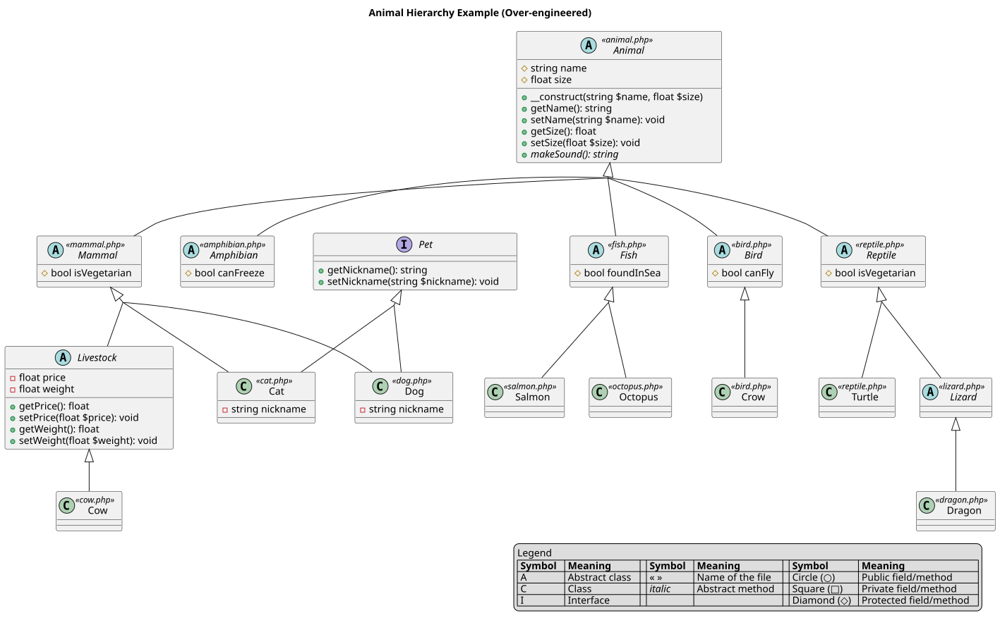

<!--
theme: custom-marp-theme
size: 16:9
paginate: true
author: L. Delafontaine, avec l'aide de GitHub Copilot
title: HEIG-VD ProgServ2 Course - Programmation orientée objet
description: Programmation orientée objet pour le cours ProgServ2 enseigné à la HEIG-VD, Suisse
url: https://heig-vd-progserv-course.github.io/heig-vd-progserv2-course/01-contenus-du-cours/05-programmation-orientee-objet/presentation.html
header: "[**Programmation orientée objet**](https://github.com/heig-vd-progserv-course/heig-vd-progserv2-course/blob/main/01-contenus-du-cours/05-programmation-orientee-objet/README.md)"
footer: '[**HEIG-VD**](https://heig-vd.ch) - [ProgServ2 2025-2026](https://github.com/heig-vd-progserv-course/heig-vd-progserv2-course) - [CC BY-SA 4.0](https://github.com/heig-vd-progserv-course/heig-vd-progserv2-course/blob/main/LICENSE.md)'
headingDivider: 6
math: mathjax
-->

# Programmation orientée objet

<!--
_class: lead
_paginate: false
-->

[ `github.com/heig-vd-progserv-course/heig-vd-progserv2-course`](https://github.com/heig-vd-progserv-course/heig-vd-progserv2-course)

[Visualiser le contenu complet sur GitHub][contenu-complet].

<small>L. Delafontaine, avec l'aide de
[GitHub Copilot](https://github.com/features/copilot).</small>

<small>Ce travail est sous licence [CC BY-SA 4.0][license].</small>

![bg opacity:0.1][illustration-principale]

## Retrouvez le contenu complet de cette présentation sur GitHub

<!-- _class: lead -->

_Cette présentation est un résumé du contenu complet disponible sur GitHub._

_Pour plus de détails, retrouvez le contenu complet [ici][contenu-complet] ou en
cliquant sur l'en-tête de ce document._

## Objectifs (1/2)

- Lister les concepts clés de la POO.
- Expliquer les avantages et les désavantages de la POO.
- Créer des classes et des objets en PHP.
- Définir des attributs et des méthodes dans une classe.
- Utiliser l'encapsulation pour protéger les données des objets.

![bg right:40%][illustration-objectifs]

## Objectifs (2/2)

- Définir des constructeurs et des destructeurs pour initialiser et nettoyer les
  objets.
- Utiliser des constantes dans les classes.
- Appliquer les notions d'interface, d'héritage et d'abstraction.

![bg right:40%][illustration-objectifs]

## Buts de la programmation orientée objet (POO)

- Paradigme de programmation basé sur des objets (= façon de penser/représenter
  l'information).
- Permet de créer des programmes modulaires et réutilisables.
- Permet de modéliser des entités du monde réel plus faciles à maintenir.

![bg right:35%][illustration-buts-de-la-programmation-orientee-objet]

## Concepts clés de la POO (1/2)

- **Classes** : modèles qui définissent les propriétés et les comportements des
  objets.
- **Objets** : instances (= création en mémoire) des classes qui représentent
  des entités concrètes.
- **Attributs** : variables qui stockent l'état des objets.

- **Méthodes** : fonctions qui définissent les comportements des objets.
- **Encapsulation** : protection des données des objets en limitant l'accès
  direct.
- **Constructeurs et destructeurs** : méthodes spéciales pour initialiser et
  nettoyer les objets.

## Concepts clés de la POO (2/2)

- **Interfaces** : contrats qui définissent les méthodes qu'une classe doit
  implémenter.
- **Héritage** : mécanisme qui permet à une classe d'hériter des propriétés et
  des méthodes d'une autre classe.
- **Classes abstraites** : mécanisme qui permet de définir des classes et des
  méthodes abstraites qui ne peuvent pas être instanciées directement.

Tous ces concepts sont utilisés pour créer des programmes modulaires,
réutilisables et faciles à maintenir.

## Avantages de la POO

- **Lisibilité** : le code est organisé en classes et objets, ce qui le rend
  plus facile à comprendre.
- **Réutilisabilité** : les classes peuvent être réutilisées, ce qui réduit la
  duplication de code.
- **Maintenabilité** : les modifications apportées à une classe n'affectent pas
  les autres classes, ce qui facilite la maintenance du code.

![bg right:35%][illustration-avantages-de-la-poo]

## Désavantages de la POO

- **Complexité** : la POO peut être plus complexe que la programmation
  procédurale, ce qui peut rendre le code plus difficile à comprendre pour les
  débutants.
- **Performance** : la POO peut être moins performante que la programmation
  procédurale, car elle nécessite plus de ressources pour créer et gérer des
  objets.

![bg right:35% ][illustration-desavantages-de-la-poo]

## La POO en PHP

- La POO est prise en charge par PHP depuis la version 5.
- PHP propose toutes les fonctionnalités de la POO (classes, objets, attributs,
  méthodes, encapsulation, constructeurs et les destructeurs, etc.).
- Explorons certains de ces concepts en PHP.

![bg right:40%][illustration-principale]

### Classes

- Une classe est un modèle qui définit les propriétés et les comportements des
  objets.
- Dans PHP, une classe est définie à l'aide du mot-clé `class`.
- Par convention, les noms de classes commencent sont en Pascal case (par
  exemple, `JeSuisUneClasse`).

![bg right:40%][illustration-classes]

---

<!-- _class: lead -->

Analysons l'exemple
[`01-classe-simple`](https://github.com/heig-vd-progserv-course/heig-vd-progserv2-course/tree/main/01-contenus-du-cours/05-programmation-orientee-objet/01-exemples-de-code/01-classe-simple/README.md).

### Instanciation d'objets

- Un objet est une instance d'une classe.
- On crée un objet en utilisant le mot-clé `new` suivi du nom de la classe suivi
  de parenthèses (`()`).
- Par convention, les noms d'objets sont écrits en Camel case (par exemple,
  `$jeSuisUnObjet`).

![bg right:40%][illustration-instanciation-dobjets]

---

<!-- _class: lead -->

Analysons l'exemple
[`01-classe-simple`](https://github.com/heig-vd-progserv-course/heig-vd-progserv2-course/tree/main/01-contenus-du-cours/05-programmation-orientee-objet/01-exemples-de-code/01-classe-simple/README.md).

### Attributs

- Les attributs sont des variables qui stockent l'état des objets.
- Accédées selon leur visibilité :
  - `public` : accessibles de partout.
  - `protected` : accessibles dans la classe et ses sous-classes.
  - `private` : accessibles uniquement dans la classe.
- Accessible via l'opérateur `->`.

![bg right:40%][illustration-attributs]

---

<!-- _class: lead -->

Analysons l'exemple
[`01-classe-simple`](https://github.com/heig-vd-progserv-course/heig-vd-progserv2-course/tree/main/01-contenus-du-cours/05-programmation-orientee-objet/01-exemples-de-code/01-classe-simple/README.md).

### Méthodes

- Fonctions qui définissent les comportements des objets.
- Définies dans la classe avec leur visibilité (`public`, `protected`,
  `private`).
- Accédées via l'opérateur `->`.
- Le mot-clé `$this` permet de faire référence à l'objet courant.

![bg right:40%][illustration-methodes]

---

<!-- _class: lead -->

Analysons l'exemple
[`02-classe-avec-une-methode-greet`](https://github.com/heig-vd-progserv-course/heig-vd-progserv2-course/tree/main/01-contenus-du-cours/05-programmation-orientee-objet/01-exemples-de-code/02-classe-avec-une-methode-greet/README.md).

### Encapsulation

- Protection des données des objets en limitant l'accès direct (avec `public`,
  `protected` et `private`).
- Permet de contrôler l'accès aux données et de garantir l'intégrité des objets.
- Utilisation de méthodes pour accéder (appelées _"getters"_ en anglais) et
  modifier les attributs (appelées _"setters"_ en anglais).

![bg right:40%][illustration-encapsulation]

---

<!-- _class: lead -->

Analysons l'exemple
[`03-classe-avec-des-setters-et-des-getters`](https://github.com/heig-vd-progserv-course/heig-vd-progserv2-course/tree/main/01-contenus-du-cours/05-programmation-orientee-objet/01-exemples-de-code/03-classe-avec-des-setters-et-des-getters/README.md).

### Constructeurs et destructeurs

- **Constructeur** : méthode spéciale appelée lors de la création d'un objet.
  Permet d'initialiser les attributs de l'objet.
- **Destructeur** : méthode spéciale appelée lors de la destruction d'un objet
  pour libérer les ressources (rarement utilisé en PHP).

![bg right:40%][illustration-constructeurs-et-destructeurs]

---

<!-- _class: lead -->

Analysons l'exemple
[`04-classe-avec-un-constructeur-et-un-destructeur`](https://github.com/heig-vd-progserv-course/heig-vd-progserv2-course/tree/main/01-contenus-du-cours/05-programmation-orientee-objet/01-exemples-de-code/04-classe-avec-un-constructeur-et-un-destructeur/README.md).

### Constantes

- Les constantes sont des valeurs qui ne changent pas pendant l'exécution du
  programme.
- Elles peuvent être définies dans une classe.
- Accessibles via l'opérateur `::` (opérateur de résolution de portée).
- En majuscules par convention (par exemple, `MA_CONSTANTE`).

![bg right:40%][illustration-constantes]

---

<!-- _class: lead -->

Analysons l'exemple
[`05-classe-avec-des-constantes`](https://github.com/heig-vd-progserv-course/heig-vd-progserv2-course/tree/main/01-contenus-du-cours/05-programmation-orientee-objet/01-exemples-de-code/05-classe-avec-des-constantes/README.md).

### Interfaces

- Les interfaces définissent un contrat que les classes doivent respecter.
- Chaque classe qui implémente une interface doit définir toutes les méthodes
  déclarées dans l'interface.
- Cela permet de garantir que certaines méthodes sont toujours présentes dans
  les classes qui implémentent l'interface.

---

<!-- _class: lead -->

Analysons l'exemple
[`07-interfaces`](https://github.com/heig-vd-progserv-course/heig-vd-progserv2-course/tree/main/01-contenus-du-cours/05-programmation-orientee-objet/01-exemples-de-code/07-interfaces/README.md).

### Héritage

- L'héritage permet à une classe fille d'hériter des propriétés et méthodes
  d'une classe parent.
- Cela favorise la réutilisation du code et la création de hiérarchies de
  classes.

---

<!-- _class: lead -->

Analysons l'exemple
[`08-heritage`](https://github.com/heig-vd-progserv-course/heig-vd-progserv2-course/tree/main/01-contenus-du-cours/05-programmation-orientee-objet/01-exemples-de-code/08-heritage/README.md).

### Classes abstraites

- Les classes abstraites définissent une base commune avec des méthodes
  partiellement implémentées.
- Une classe abstraite ne peut pas être instanciée directement.
- Les classes filles doivent implémenter les méthodes abstraites définies dans
  la classe abstraite.

---

<!-- _class: lead -->

Analysons l'exemple
[`09-classes-abstraites`](https://github.com/heig-vd-progserv-course/heig-vd-progserv2-course/tree/main/01-contenus-du-cours/05-programmation-orientee-objet/01-exemples-de-code/09-classes-abstraites/README.md).

### Inclusion des fichiers et classes

- Pour organiser le code, chaque classe peut être définie dans son propre
  fichier.
- Il est important de gérer correctement l'inclusion des fichiers pour éviter
  les erreurs.
- L'inclusion manuelle consiste à inclure chaque fichier de classe
  individuellement avec `require` ou `include`.
- Il est préférable d'utiliser `require_once` ou `include_once` pour éviter les
  inclusions multiples.
- Illustrons les problèmes potentiels avec un exemple simple.

---

<!-- _class: lead -->

Analysons les exemples
[`10-inclusion-manuelle-avec-require`](https://github.com/heig-vd-progserv-course/heig-vd-progserv2-course/tree/main/01-contenus-du-cours/05-programmation-orientee-objet/01-exemples-de-code/10-inclusion-manuelle-avec-require/README.md)
et
[`11-inclusion-manuelle-avec-require-once`](https://github.com/heig-vd-progserv-course/heig-vd-progserv2-course/tree/main/01-contenus-du-cours/05-programmation-orientee-objet/01-exemples-de-code/11-inclusion-manuelle-avec-require-once/README.md).

### Limites de l'héritage et de l'abstraction

- PHP ne supporte pas l'héritage multiple (une classe ne peut hériter que d'une
  seule classe parent).
- Mais une classe peut implémenter plusieurs interfaces.
- Ces concepts sont à utiliser avec parcimonie pour éviter une complexité
  excessive :
  - Restez simple.
  - Évitez les hiérarchies trop profondes ou complexes.

---

## Conclusion

- La POO permet de créer des programmes modulaires et réutilisables.
- Améliore la lisibilité, la réutilisabilité et la maintenabilité du code.
- PHP prend en charge la POO et propose toutes les fonctionnalités nécessaires
  pour créer des classes et des objets.
- Les concepts avancés de la POO, tels que les interfaces, l'héritage et
  l'abstraction, permettent de créer des applications modulaires et
  maintenables, mais il faut les utiliser avec parcimonie pour éviter une
  complexité excessive.

## Questions

<!-- _class: lead -->

Est-ce que vous avez des questions ?

## À vous de jouer !

- (Re)lire le support de cours.
- Explorer les exemples de code.
- Faire les exercices.
- Poser des questions si nécessaire.

➡️ [Visualiser le contenu complet sur GitHub][contenu-complet].

**N'hésitez pas à vous entraider si vous avez des difficultés !**

![bg right:40%][illustration-a-vous-de-jouer]

## Sources (1/2)

- [Illustration principale][illustration-principale] par
  [Richard Jacobs](https://unsplash.com/@rj2747) sur
  [Unsplash](https://unsplash.com/photos/grayscale-photo-of-elephants-drinking-water-8oenpCXktqQ)
- [Illustration][illustration-objectifs] par
  [Aline de Nadai](https://unsplash.com/@alinedenadai) sur
  [Unsplash](https://unsplash.com/photos/j6brni7fpvs)
- [Illustration][illustration-buts-de-la-programmation-orientee-objet] par
  [Eric Prouzet](https://unsplash.com/@eprouzet) sur
  [Unsplash](https://unsplash.com/photos/assorted-color-mugs-on-rack-5lUMTeo7-bE)
- [Illustration][illustration-avantages-de-la-poo] par
  [Thomas Le](https://unsplash.com/@thomasble) sur
  [Unsplash](https://unsplash.com/photos/white-arrow-up-yoPOtxc0s6c)
- [Illustration][illustration-desavantages-de-la-poo] par
  [Ussama Azam](https://unsplash.com/@ussamaazam) sur
  [Unsplash](https://unsplash.com/photos/pink-arrow-neon-sign-26h317_UMYM)
- [Illustration][illustration-classes] par
  [Feliphe Schiarolli](https://unsplash.com/@flpschi) sur
  [Unsplash](https://unsplash.com/photos/photography-of-school-room-hes6nUC1MVc)
- [Illustration][illustration-instanciation-dobjets] par
  [Kenny Eliason](https://unsplash.com/@neonbrand) sur
  [Unsplash](https://unsplash.com/photos/a-group-of-people-in-a-room-with-a-projector-screen-1-aA2Fadydc)
- [Illustration][illustration-attributs] par
  [Pearse O'Halloran](https://unsplash.com/@pearseoh) sur
  [Unsplash](https://unsplash.com/photos/black-and-white-wooden-wall-decor-t0N-LwOu0hg)

## Sources (2/2)

- [Illustration][illustration-methodes] par
  [Birmingham Museums Trust](https://unsplash.com/@birminghammuseumstrust) sur
  [Unsplash](https://unsplash.com/photos/grayscale-photo-of-people-in-a-street-y3TC9H0261s)
- [Illustration][illustration-encapsulation] par
  [Erol Ahmed](https://unsplash.com/@erol) sur
  [Unsplash](https://unsplash.com/photos/close-up-photography-of-brown-wooden-card-catalog-Y3KEBQlB1Zk)
- [Illustration][illustration-constructeurs-et-destructeurs] par
  [Scott Blake](https://unsplash.com/@sunburned_surveyor) sur
  [Unsplash](https://unsplash.com/photos/seven-construction-workers-standing-on-white-field-x-ghf9LjrVg)
- [Illustration][illustration-constantes] par
  [Lluvia Morales](https://unsplash.com/@hi_lluvia) sur
  [Unsplash](https://unsplash.com/photos/brown-concrete-blocks-in-close-up-photography-tO2FyAcS03s)
- [Illustration][illustration-a-vous-de-jouer] par
  [Nikita Kachanovsky](https://unsplash.com/@nkachanovskyyy) sur
  [Unsplash](https://unsplash.com/photos/white-sony-ps4-dualshock-controller-over-persons-palm-FJFPuE1MAOM)

<!-- URLs -->

[contenu-complet]:
	https://github.com/heig-vd-progserv-course/heig-vd-progserv2-course/tree/main/01-contenus-du-cours/05-programmation-orientee-objet/README.md
[license]:
	https://github.com/heig-vd-progserv-course/heig-vd-progserv1-course/blob/main/LICENSE.md

<!-- Illustrations -->

[illustration-principale]:
	https://images.unsplash.com/photo-1517486430290-35657bdcef51?fit=crop&h=720
[illustration-objectifs]:
	https://images.unsplash.com/photo-1516389573391-5620a0263801?fit=crop&h=720
[illustration-buts-de-la-programmation-orientee-objet]:
	https://images.unsplash.com/photo-1563696629964-8c3ce077cf3e?fit=crop&h=720
[illustration-avantages-de-la-poo]:
	https://images.unsplash.com/photo-1551657531-a303c5f54203?fit=crop&h=720
[illustration-desavantages-de-la-poo]:
	https://images.unsplash.com/photo-1572314961011-aece24e1cc48?fit=crop&h=720
[illustration-classes]:
	https://images.unsplash.com/photo-1510531704581-5b2870972060?fit=crop&h=720
[illustration-instanciation-dobjets]:
	https://images.unsplash.com/photo-1524178232363-1fb2b075b655?fit=crop&h=720
[illustration-attributs]:
	https://images.unsplash.com/photo-1510913415497-e34c432bd039?fit=crop&h=720
[illustration-methodes]:
	https://images.unsplash.com/photo-1583737097406-5a4b42b37b97?fit=crop&h=720
[illustration-encapsulation]:
	https://images.unsplash.com/photo-1511721285502-9f81e79be874?fit=crop&h=720
[illustration-constructeurs-et-destructeurs]:
	https://images.unsplash.com/photo-1541888946425-d81bb19240f5?fit=crop&h=720
[illustration-constantes]:
	https://images.unsplash.com/photo-1629608444154-6d052691632f?fit=crop&h=720
[illustration-a-vous-de-jouer]:
	https://images.unsplash.com/photo-1509198397868-475647b2a1e5?fit=crop&h=720
