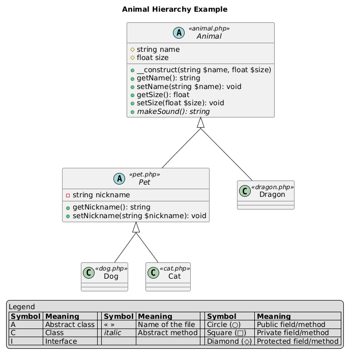
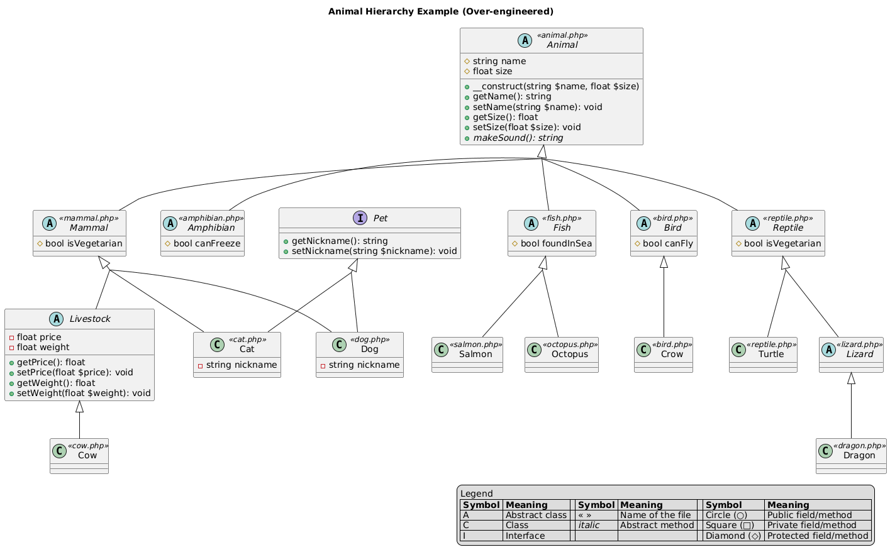

# Programmation orientée objet

L. Delafontaine, avec l'aide de
[GitHub Copilot](https://github.com/features/copilot).

Ce travail est sous licence [CC BY-SA 4.0][licence].

> [!TIP]
>
> Voici quelques informations relatives à ce contenu.
>
> **Ressources annexes**
>
> - Autres formats :
>   [Presentation (web)](https://heig-vd-progserv-course.github.io/heig-vd-progserv2-course/01-contenus-du-cours/05-programmation-orientee-objet/presentation.html)
>   ·
>   [Presentation (PDF)](https://heig-vd-progserv-course.github.io/heig-vd-progserv2-course/01-contenus-du-cours/05-programmation-orientee-objet/05-programmation-orientee-objet-presentation.pdf)
> - Exemples de code : [Code source](./01-exemples-de-code/README.md).
> - Exercices : [Énoncés et solutions](./02-exercices/README.md).
>
> **Objectifs**
>
> - Rappeler les concepts de base de la programmation orientée objet.
> - Appliquer les notions d'interface, d'héritage et d'abstraction avec la
>   programmation orientée objet.
>
> **Méthodes d'enseignement et d'apprentissage**
>
> Les méthodes d'enseignement et d'apprentissage utilisées pour animer le cours
> sont les suivantes :
>
> - Présentation.
> - Discussions collectives.
> - Travail en autonomie.
>
> **Méthodes d'évaluation**
>
> L'évaluation prend la forme d'exercices à réaliser en autonomie en classe ou à
> la maison.
>
> L'évaluation se fait en utilisant les critères suivants :
>
> - Capacité à s'approprier des exemples de code.
> - Capacité à appliquer les exemples de code à des situations similaires.
> - Capacité à répondre avec justesse.
> - Capacité à argumenter.
>
> Les retours se font de la manière suivante :
>
> - Corrigé des exercices.
>
> L'évaluation ne donne pas lieu à une note.

## Table des matières

- [Table des matières](#table-des-matières)
- [Objectifs](#objectifs)
- [La programmation orientée objet, un paradigme de programmation](#la-programmation-orientée-objet-un-paradigme-de-programmation)
- [Interfaces](#interfaces)
- [Héritage](#héritage)
- [Abstraction](#abstraction)
- [Inclusion des fichiers et classes](#inclusion-des-fichiers-et-classes)
  - [Inclusion manuelle](#inclusion-manuelle)
  - [Espaces de noms (namespaces)](#espaces-de-noms-namespaces)
  - [Inclusion automatique (autoloader)](#inclusion-automatique-autoloader)
- [Limites de l'héritage et de l'abstraction](#limites-de-lhéritage-et-de-labstraction)
- [Conclusion](#conclusion)
- [Exemples de code](#exemples-de-code)
- [Exercices](#exercices)
- [À faire pour la semaine suivante](#à-faire-pour-la-semaine-suivante)

## Objectifs

TODO


## Objectifs

Dans ce dernier cours, nous allons aborder la programmation orientée objet (POO)
en PHP. Nous allons voir les concepts clés de la POO, tels que les classes, les
objets, les attributs, les méthodes, l'encapsulation, les constructeurs et les
destructeurs, ainsi que les constantes. Nous allons également discuter des
avantages et des désavantages de la POO, ainsi que de son utilisation en PHP.

De façon plus concise, les personnes qui étudient devraient être capables de :

- Lister les concepts clés de la POO.
- Expliquer les avantages et les désavantages de la POO.
- Créer des classes et des objets en PHP.
- Définir des attributs et des méthodes dans une classe.
- Utiliser l'encapsulation pour protéger les données des objets.
- Définir des constructeurs et des destructeurs pour initialiser et nettoyer les
  objets.
- Utiliser des constantes dans les classes.

## Buts de la programmation orientée objet (POO)

La programmation orientée objet (POO) est un paradigme de programmation (= une
façon de penser/représenter l'information) qui permet de structurer le code en
regroupant les données et les comportements dans des entités appelées classes.

Les classes sont des modèles qui définissent les propriétés et les méthodes des
objets. Les objets sont des instances de ces classes et représentent des entités
concrètes de l'application.

La POO permet de créer des applications plus modulaires, réutilisables et
maintenables. Elle offre une approche plus naturelle pour modéliser le monde
réel, en regroupant les données et les comportements liés dans des entités
cohérentes.

## Concepts clés de la POO

- **Classes** : modèles qui définissent les propriétés et les comportements des
  objets.
- **Objets** : instances (= création en mémoire) des classes qui représentent
  des entités concrètes.
- **Attributs** : propriétés des objets (définies dans les classes) qui stockent
  l'état des objets.
- **Méthodes** : fonctions (définies dans les classes) qui définissent les
  comportements des objets.
- **Encapsulation** : pratique consistant à regrouper les données et les
  comportements dans des classes, en limitant l'accès direct aux attributs pour
  protéger l'intégrité des données.
- **Constructeurs et destructeurs** : méthodes spéciales pour initialiser et
  nettoyer les objets. Les constructeurs sont appelés lors de la création d'un
  objet, tandis que les destructeurs sont appelés lors de la destruction de
  l'objet.

Il existe d'autres concepts clés de la POO, tels que l'héritage et le
polymorphisme, qui permettent de créer des relations entre les classes et de
réutiliser le code ainsi que les méthodes statiques et pleins d'autres concepts
avancés comme les interfaces, les traits, les namespaces, les exceptions, etc.

Cependant, ces concepts ne seront pas abordés dans ce cours.

## Avantages de la POO

- **Lisibilité** : le code est plus facile à lire et à comprendre, car les
  classes regroupent les données et les comportements liés.
- **Réutilisabilité** : les classes peuvent être réutilisées dans d'autres
  parties de l'application ou dans d'autres applications, ce qui réduit la
  duplication du code.
- **Maintenabilité** : les modifications apportées à une classe n'affectent pas
  les autres classes, ce qui facilite la maintenance du code.

## Désavantages de la POO

- **Complexité** : la POO peut introduire une certaine complexité, surtout pour
  les petites applications où une approche procédurale pourrait être plus
  simple.
- **Performance** : la POO peut être moins performante que la programmation
  procédurale, car elle nécessite une gestion supplémentaire des objets et des
  classes. Cependant, cette différence de performance est souvent négligeable
  dans la plupart des applications modernes.

## La POO en PHP

La POO est prise en charge par PHP depuis la version 5. Elle permet de créer des
classes et des objets, d'utiliser l'encapsulation, et de définir des attributs
et des méthodes. PHP offre également des fonctionnalités avancées comme
l'héritage, le polymorphisme et les interfaces.

### Classes

Une classe est un modèle qui définit les propriétés et les comportements des
objets.

Les classes en PHP sont définies à l'aide du mot-clé `class`. Elles peuvent
avoir des attributs (variables qui définissent des propriétés) et des méthodes
(fonctions qui définissent des comportements).

Voici un exemple simple de classe en PHP :

```php
<?php
class Person {
    public $name;
    public $age;
}
```

<details>
<summary>Afficher l'équivalent en Java</summary>

```java
public class Person {
    public String name;
    public int age;
}
```

</details>

Dans cet exemple, nous avons défini une classe `Person` avec le mot-clé `class`.
Par convention, les noms de classes sont écrits en Pascal case (c'est-à-dire que
chaque mot commence par une majuscule).

### Instanciation d'objets

Pour créer des objets à partir d'une classe, on utilise le mot-clé `new` suivi
du nom de la classe suivi de parenthèses (`()`).

Par convention, les noms d'objets sont écrits en Camel case (c'est-à-dire que le
premier mot commence par une minuscule et les mots suivants commencent par une
majuscule).

Voici comment instancier un objet de la classe `Person` :

```php
$person = new Person();
```

<details>
<summary>Afficher l'équivalent en Java</summary>

```java
Person person = new Person();
```

</details>

Ici, `$person` est un objet de la classe `Person`. On peut créer plusieurs
objets à partir de la même classe, chacun ayant ses propres valeurs pour les
attributs définis dans la classe.

```php
$person1 = new Person();
$person2 = new Person();
```

<details>
<summary>Afficher l'équivalent en Java</summary>

```java
Person person1 = new Person();
Person person2 = new Person();
```

</details>

### Attributs

Les attributs d'une classe sont des variables qui stockent l'état/les données de
l'objet.

Ils sont définis dans la classe et peuvent être accédées selon leur visibilité
(`public` - accessibles de partout, `protected` - accessibles dans la classe et
ses sous-classes ou `private` - accessibles uniquement dans la classe).

Les attributs sont déclarés à l'intérieur de la classe, et ils peuvent être de
n'importe quel type de données, y compris d'autres objets.

Les attributs d'un objet sont accessibles via l'opérateur `->`.

Dans la classe `Person`, nous avons défini deux attributs :

1. `$name`
2. `$age`

Ils sont déclarés comme `public`, ce qui signifie qu'ils peuvent être accédés
directement depuis l'extérieur de la classe. Voici comment on peut utiliser ces
attributs :

```php
$person = new Person();

$person->name = "Alice";
$person->age = 30;
```

<details>
<summary>Afficher l'équivalent en Java</summary>

```java
Person person = new Person();

person.name = "Alice";
person.age = 30;
```

</details>

L'opérateur `->` permet d'accéder aux attributs d'un objet. Dans cet exemple,
nous avons créé un objet `$person` de la classe `Person` présentée précédemment.
Puis nous avons assigné des valeurs aux attributs `name` et `age` de cet objet.
On peut également accéder aux attributs d'un objet pour les lire :

```php
echo $person->name . "<br>"; // Affiche "Alice"
echo $person->age;  // Affiche 30
```

<details>
<summary>Afficher l'équivalent en Java</summary>

```java
System.out.println(person.name); // Affiche "Alice"
System.out.println(person.age);  // Affiche 30
```

</details>

### Méthodes

Les méthodes d'une classe sont des fonctions qui définissent les comportements
de l'objet. Tout comme les attributs, les méthodes sont définies à l'intérieur
de la classe et peuvent être accédées selon leur visibilité (`public`,
`protected` ou `private`).

Elles sont définies à l'intérieur de la classe et peuvent être appelées sur les
objets de cette classe.

Voici un exemple de classe avec une méthode :

```php
<?php
class Person {
    public $name;
    public $age;

    public function greet() {
        return "Hi, my name is " . $this->name .
            " and I am " . $this->age .
            " years old.";
    }
}
```

<details>
<summary>Afficher l'équivalent en Java</summary>

```java
public class Person {
    public String name;
    public int age;

    public String greet() {
        return "Hi, my name is " + this.name +
            " and I am " + this.age +
            " years old.";
    }
}
```

</details>

Dans cet exemple, la classe `Person` a une méthode `greet()` qui retourne une
chaîne de caractères contenant le nom et l'âge de la personne. On peut appeler
cette méthode sur un objet de la classe `Person` :

```php
$person = new Person();

$person->name = "Alice";
$person->age = 30;

echo $person->greet(); // Affiche "Hi, my name is Alice and I am 30 years old."
```

<details>
<summary>Afficher l'équivalent en Java</summary>

```java
Person person = new Person();

person.name = "Alice";
person.age = 30;

System.out.println(person.greet()); // Affiche "Hi, my name is Alice and I am 30 years old."
```

</details>

Le mot-clé `$this` est utilisé à l'intérieur des méthodes pour faire référence à
l'objet courant. Il permet d'accéder aux attributs et aux autres méthodes de
l'objet depuis l'intérieur de la méthode.

Dans la classe `Person`, la méthode `greet()` utilise `$this->name` et
`$this->age` pour accéder aux attributs de l'objet courant.

### Encapsulation

L'encapsulation est une pratique importante en POO qui consiste à protéger les
données d'un objet en limitant l'accès direct à ses attributs.

Ce mécanisme permet de contrôler comment les données sont modifiées et lues, en
fournissant des méthodes d'accès (appelées _"getters"_ en anglais) et de
modification (appelées _"setters"_ en anglais) avec des validations des données
si nécessaire.

En PHP, on peut utiliser les modificateurs d'accès `public`, `protected` et
`private` pour contrôler la visibilité des attributs et des méthodes. Voici un
exemple :

```php
<?php
class Person {
    private $name; // Attribut privé
    private $age; // Attribut privé

    public function setName($name) {
        if (strlen($name) < 3) {
            return "Name must be at least 3 characters long.";
        }

        $this->name = $name;
    }

    public function getName() {
        return $this->name;
    }

    public function setAge($age) {
        if ($age < 0) {
            return "Age cannot be negative.";
        }

        $this->age = $age;
    }

    public function getAge() {
        return $this->age;
    }
}
```

<details>
<summary>Afficher l'équivalent en Java</summary>

```java
public class Person {
    private String name; // Attribut privé
    private int age; // Attribut privé

    public String setName(String name) {
        if (name.length() < 3) {
            return "Name must be at least 3 characters long.";
        }

        this.name = name;

        return null;
    }

    public String getName() {
        return this.name;
    }

    public String setAge(int age) {
        if (age < 0) {
            return "Age cannot be negative.";
        }

        this.age = age;

        return null;
    }

    public int getAge() {
        return this.age;
    }
}
```

</details>

Dans cet exemple, les attributs `$name` et `$age` sont déclarés comme `private`,
ce qui signifie qu'ils ne peuvent pas être accédés directement depuis
l'extérieur de la classe. Au lieu de cela, on utilise des méthodes `setName()`,
`getName()`, et `setAge()`, `getAge()` pour modifier et lire les valeurs de ces
attributs.

Grâce aux getters, on peut lire les valeurs des attributs, et grâce aux setters,
on peut les modifier. Les setters peuvent également inclure des validations pour
s'assurer que les valeurs assignées sont valides. Cela permet de garantir que
les données de l'objet sont toujours dans un état cohérent et valide.

> [!TIP]
>
> Dans une application réelle, il serait plus judicieux de gérer les validations
> des données à l'aide d'exceptions ou d'autres mécanismes pour éviter de
> retourner des chaînes de caractères depuis les setters.
>
> Dans le contexte de ce cours, ce mécanisme est suffisant pour illustrer le
> concept d'encapsulation et de validation des données.

Voici comment on peut utiliser cette classe :

```php
$person = new Person();

$error = $person->setName("Alice");

if (!empty($error)) {
	echo $error . "<br>";
}

$error = $person->setAge(30);

if (!empty($error)) {
	echo $error . "<br>";
}

echo $person->getName() . "<br>"; // Affiche "Alice"
echo $person->getAge() . "<br>";  // Affiche 30

$error = $person->setName("AS");

if (!empty($error)) {
    echo $error . "<br>";
}

$error = $person->setAge(-1);

if (!empty($error)) {
    echo $error . "<br>";
}

$person->name = "Bob"; // Erreur : l'attribut est privé
```

<details>
<summary>Afficher l'équivalent en Java</summary>

```java
Person person = new Person();

String error = person.setName("Alice");

if (error != null) {
    System.out.println(error);
}

error = person.setAge(30);

if (error != null) {
    System.out.println(error);
}

System.out.println(person.getName()); // Affiche "Alice"
System.out.println(person.getAge());  // Affiche 30

error = person.setName("AS");

if (error != null) {
    System.out.println(error);
}

error = person.setAge(-1);

if (error != null) {
    System.out.println(error);
}

person.name = "Bob"; // Erreur : l'attribut est privé
```

</details>

### Constructeurs et destructeurs

Les constructeurs et destructeurs sont des méthodes spéciales qui sont appelées
automatiquement lors de la création et de la destruction d'un objet.

Un constructeur est défini avec le mot-clé `__construct()` et est utilisé pour
initialiser les attributs d'un objet lors de sa création.

Un destructeur est défini avec le mot-clé `__destruct()` et est utilisé pour
effectuer des nettoyages ou des opérations finales avant que l'objet ne soit
détruit si besoin.

Un objet est détruit automatiquement à la fin du script ou lorsque l'objet n'est
plus référencé (= que sa valeur est assignée à `null` ou qu'il n'est plus
utilisé dans le code, par exemple en sortant de la portée d'un bloc de code ou
en assignant une nouvelle valeur à la variable qui référait à l'objet).

```php
<?php
class Person {
    private $name;
    private $age;

    public function __construct($name, $age) {
        $this->name = $name;
        $this->age = $age;
    }

    public function __destruct() {
        echo $this->name . " is being destroyed.<br>";
    }

    public function greet() {
        return "Hi, my name is " . $this->name . " and I am " . $this->age . " years old.";
    }
}
```

<details>
<summary>Afficher l'équivalent en Java</summary>

_En Java, il n'y a pas de destructeur explicite comme en PHP. Il est possible
d'utiliser certains mécanismes pour nettoyer les ressources, mais ils ne sont
pas recommandés pour des raisons de performance et de gestion de la mémoire. Ils
ne seront donc pas abordés ici._

```java
public class Person {
    private String name;
    private int age;

    public Person(String name, int age) {
        this.name = name;
        this.age = age;
    }

    public String greet() {
        return "Hi, my name is " + this.name + " and I am " + this.age + " years old.";
    }
}
```

</details>

Dans cet exemple, le constructeur `__construct()` est utilisé pour initialiser
les attributs `$name` et `$age` de l'objet lors de sa création.

Le destructeur `__destruct()` est appelé automatiquement lorsque l'objet est
détruit, par exemple à la fin du script ou lorsque l'objet n'est plus référencé.

Voici comment on peut utiliser cette classe :

```php
$alice = new Person("Alice", 30);
$bob = new Person("Bob", 25);
$evelyn = new Person("Evelyn", 40);

echo $alice->greet() . "<br>";
echo $bob->greet() . "<br>";
echo $evelyn->greet() . "<br>";

// L'objet `$bob` a maintenant la valeur `null`.
// L'objet est donc détruit et le destructeur est appelé.
$bob = null;

// L'objet `$evelyn` référence maintenant le même objet que `$alice`.
// L'objet `$evelyn` n'est plus utilisé et est donc détruit.
$evelyn = $alice;

// L'objet `$alice` sera automatiquement détruit à la fin du script.
// Son destructeur sera appelé.
```

<details>
<summary>Afficher l'équivalent en Java</summary>

```java
Person alice = new Person("Alice", 30);
Person bob = new Person("Bob", 25);
Person evelyn = new Person("Evelyn", 40);

System.out.println(alice.greet());
System.out.println(bob.greet());
System.out.println(evelyn.greet());

// En Java, il n'y a pas de destructeur explicite.
// Mais tout objet avec une valeur `null` est éligible pour le garbage collector.
bob = null;

// L'objet `evelyn` référence maintenant le même objet que `alice`.
// L'objet `evelyn` n'est plus utilisé et sera éligible pour le garbage collector.
evelyn = alice;

// L'objet `alice` sera éligible pour le garbage collector à la fin du programme.
```

</details>

### Constantes

En PHP, on peut également définir des constantes au sein d'une classe. Les
constantes sont des valeurs qui ne changent pas et qui sont définies avec le
mot-clé `const`. Elles sont accessibles via l'opérateur `::` (opérateur de
résolution de portée).

Voici un exemple de classe avec des constantes :

```php
<?php
class Person {
    const ROLE_MANAGER = 'Manager';
    const ROLE_DEVELOPER = 'Developer';
    const ROLE_DESIGNER = 'Designer';
    const ROLE_EMPLOYEE = 'Employee';

    private $name;
    private $role;

    public function __construct($name, $role) {
        $this->name = $name;
        $this->role = $role;
    }

    public function greet() {
        return "Hi, my name is " . $this->name . ". I work as a " . $this->role . " at my company.";
    }
}
```

<details>
<summary>Afficher l'équivalent en Java</summary>

```java
public class Person {
    public static final String ROLE_MANAGER = "Manager";
    public static final String ROLE_DEVELOPER = "Developer";
    public static final String ROLE_DESIGNER = "Designer";
    public static final String ROLE_EMPLOYEE = "Employee";

    private String name;
    private String role;

    public Person(String name, String role) {
        this.name = name;
        this.role = role;
    }

    public String greet() {
        return "Hi, my name is " + this.name + ". I work as a " + this.role + " at my company.";
    }
}
```

</details>

Dans cet exemple, nous avons défini des constantes pour les rôles des employés
dans la classe `Person`. Ces constantes sont utilisées pour initialiser le rôle
de chaque personne lors de la création de l'objet.

Voici comment on peut utiliser cette classe :

```php
$alice = new Person("Alice", Person::ROLE_DEVELOPER);
$bob = new Person("Bob", Person::ROLE_MANAGER);
$evelyn = new Person("Evelyn", Person::ROLE_DESIGNER);

// Affiche "Hi, my name is Alice. I work as a Developer at my company."
echo $alice->greet() . "<br>";

// Affiche "Hi, my name is Bob. I work as a Manager at my company."
echo $bob->greet() . "<br>";

// Affiche "Hi, my name is Evelyn. I work as a Designer at my company."
echo $evelyn->greet();
```

<details>
<summary>Afficher l'équivalent en Java</summary>

```java
Person alice = new Person("Alice", Person.ROLE_DEVELOPER);
Person bob = new Person("Bob", Person.ROLE_MANAGER);
Person evelyn = new Person("Evelyn", Person.ROLE_DESIGNER);

// Affiche "Hi, my name is Alice. I work as a Developer at my company."
System.out.println(alice.greet());

// Affiche "Hi, my name is Bob. I work as a Manager at my company."
System.out.println(bob.greet());

// Affiche "Hi, my name is Evelyn. I work as a Designer at my company."
System.out.println(evelyn.greet());
```

</details>

Les constantes sont accessibles via la syntaxe `NomDeLaClasse::NOM_CONSTANTE`,
ce qui permet de utiliser des valeurs fixes et lisibles dans le code, tout en
évitant les erreurs de frappe ou de modification accidentelle des valeurs.

Par défaut, les constantes sont `public`, ce qui signifie qu'elles peuvent être
accédées depuis l'extérieur de la classe sans avoir besoin de méthodes d'accès.
Cependant, elles ne peuvent pas être modifiées une fois définies.

## Conclusion

La programmation orientée objet (POO) est un paradigme de programmation qui
permet de structurer le code en regroupant les données et les comportements dans
des entités appelées classes.

Elle offre de nombreux avantages, tels que la lisibilité, la réutilisabilité et
la maintenabilité du code. PHP prend en charge la POO depuis la version 5,
permettant de créer des classes et des objets, d'utiliser l'encapsulation, et de
définir des attributs et des méthodes.

La POO est un outil puissant pour structurer le code et faciliter le
développement d'applications complexes. Cependant, elle peut introduire une
certaine complexité. Il faut savoir l'utiliser judicieusement en fonction des
besoins de l'application.

Au travers de ce dernier cours, nous avons vu les concepts clés de la POO, tels
que les classes, les objets, les attributs, les méthodes, l'encapsulation, les
constructeurs et destructeurs, ainsi que les constantes. Nous avons également
abordé les avantages et les désavantages de la POO, ainsi que son utilisation en
PHP.


## La programmation orientée objet, un paradigme de programmation

La programmation orientée objet (POO) est un paradigme de programmation qui
utilise des "objets" pour représenter des données et des comportements.

La programmation orientée objet permet de structurer le code de manière plus
modulaire et réutilisable.

```php
<?php
class User {
    // Propriétés (attributs)
    private string $firstName;
    private string $lastName;

    // Constructeur
    public function __construct(string $firstName, string $lastName) {
        $this->firstName = $firstName;
        $this->lastName = $lastName;
    }

    // Méthodes
    public function getFirstName(): string {
        return $this->firstName;
    }

    public function setFirstName(string $firstName): void {
        $this->firstName = $firstName;
    }

    public function getLastName(): string {
        return $this->lastName;
    }

    public function setLastName(string $lastName): void {
        $this->lastName = $lastName;
    }

    public function getFullName(): string {
        return "{$this->firstName} {$this->lastName}";
    }
}
```

Les attributs (propriétés) sont des variables qui stockent l'état de l'objet,
tandis que les méthodes sont des fonctions qui définissent le comportement de
l'objet.

Grâce aux dernières versions de PHP, il est possible de typer les attributs
d'une classe de la même manière que pour les paramètres et le retour des
fonctions.

Les attributs et les méthodes peuvent avoir différents niveaux de visibilité :
`public`, `protected` et `private`. Il est recommandé d'utiliser `protected` ou
`private` pour les attributs afin de favoriser l'encapsulation.

Grâce à l'encapsulation, les attributs d'une classe ne sont pas accessibles
directement depuis l'extérieur de la classe. On utilise des méthodes publiques
pour accéder et modifier les attributs (communément appelées _getters_ et
_setters_).

Le constructeur est une méthode spéciale qui est appelée lors de la création
d'un objet.

Une classe est instanciée (créée) à l'aide du mot-clé `new`, ce qui crée un
nouvel objet de cette classe :

```php
// Création d'objets (instanciation)
$user1 = new User("Alice", "Smith");
$user2 = new User("Bob", "Johnson");

// Utilisation des méthodes
echo $user1->getFirstName() . "<br>";   // "Alice"
echo $user2->getFullName() . "<br>";    // "Bob Johnson"
$user2->setLastName("Doe");             // Modifie le nom de famille de Bob
echo $user2->getFullName() . "<br>";    // "Bob Doe"
```

## Interfaces

Les interfaces définissent un contrat que les classes doivent respecter. Elles
spécifient quelles méthodes une classe doit implémenter sans définir leur
implémentation.

Considérons une interface `AnimalInterface` qui définit les méthodes que toutes
les classes d'animaux doivent implémenter.

```php
<?php
interface AnimalInterface {
    public function makeSound(): string;
    public function getHabitat(): string;
}
```

Cette interface déclare deux méthodes : `makeSound` et `getHabitat`. Toutes les
classes qui implémentent cette interface doivent fournir une implémentation pour
ces méthodes.

```php
class Lion implements AnimalInterface {
    public function makeSound(): string {
        return "Roar!";
    }

    public function getHabitat(): string {
        return "Savannah";
    }
}

class Penguin implements AnimalInterface {
    public function makeSound(): string {
        return "Honk!";
    }

    public function getHabitat(): string {
        return "Antarctica";
    }
}
```

Grâce aux interfaces, nous pouvons garantir que toutes les classes d'animaux
implémentent les mêmes méthodes, ce qui facilite le polymorphisme.

```php
$lion = new Lion();
$penguin = new Penguin();

echo $lion->makeSound();        // "Roar!"
echo $lion->getHabitat();       // "Savannah"
echo $penguin->makeSound();     // "Honk!"
echo $penguin->getHabitat();    // "Antarctica"
```

Le polymorphisme permet de traiter différents types d'objets de manière uniforme
lorsqu'ils implémentent la même interface. Ici, tous les animaux peuvent être
traités de la même manière grâce à l'interface `AnimalInterface`.

## Héritage

L'héritage permet à une classe (classe fille) d'hériter des propriétés et
méthodes d'une autre classe (classe parent), favorisant la réutilisation du
code.

A la différence des interfaces, une classe peut inclure les attributs et
méthodes d'une autre classe.

```php
<?php
class Plant {
    protected string $englishName;
    protected string $latinName;

    public function __construct(string $englishName, string $latinName) {
        $this->englishName = $englishName;
        $this->latinName = $latinName;
    }

    public function getEnglishName(): string {
        return $this->englishName;
    }

    public function getLatinName(): int {
        return $this->latinName;
    }
}
```

Ici, la classe `Plant` est une classe de base qui représente une plante avec son
nom anglais et son nom latin.

Les attributs sont `protected`, ce qui signifie qu'ils sont accessibles dans la
classe et ses sous-classes.

Si des attributs sont privés (`private`), ils ne sont pas accessibles dans les
sous-classes.

```php
class Basil extends Plant {
    private string $variety;

    public function __construct(string $englishName, string $latinName, string $variety) {
        parent::__construct($englishName, $latinName);
        $this->variety = $variety;
    }

    public function getVariety(): string {
        return $this->variety;
    }
}

class Tomato extends Plant {
    private string $color;

    public function __construct(string $englishName, string $latinName, string $color) {
        parent::__construct($englishName, $latinName);
        $this->color = $color;
    }

    public function getColor(): string {
        return $this->color;
    }
}
```

Ici, nous avons deux classes filles, `Basil` et `Tomato`, qui héritent de la
classe `Plant`. Elles ajoutent chacune un attribut spécifique (`variety` pour le
basilic et `color` pour la tomate) et redéfinissent le constructeur pour
initialiser ces nouveaux attributs.

Dans le constructeur des classes filles, nous appelons le constructeur de la
classe parent avec `parent::__construct(...)` pour initialiser les attributs
hérités.

```php
$plant = new Plant("Generic Plant", "Plantae");
$basil = new Basil("Basil", "Ocimum basilicum", "Sweet Basil");
$tomato = new Tomato("Tomato", "Solanum lycopersicum", "Red");

echo $plant->getEnglishName(); // "Generic Plant"
echo $plant->getLatinName();   // "Plantae"
echo $basil->getVariety();     // "Sweet Basil"
echo $tomato->getColor();      // "Red"
```

Ces classes peuvent être ensuite utilisées pour créer des objets représentant
des plantes spécifiques.

## Abstraction

Les classes abstraites permettent de définir une base commune avec des méthodes
partiellement implémentées. Elles ne peuvent pas être instanciées directement.

Nous pouvons imaginer une classe abstraite comme un mélange entre une interface
et une classe normale.

```php
<?php
abstract class Shape {
    protected string $color;

    public function __construct(string $color) {
        $this->color = $color;
    }

    // Méthode concrète (implémentée)
    public function getColor(): string {
        return $this->color;
    }

    // Méthodes abstraites (doivent être implémentées par les classes filles)
    abstract public function calculateArea(): float;
    abstract public function calculatePerimeter(): float;

    // Méthode concrète utilisant les méthodes abstraites
    public function getShapeInfo(): string {
        return sprintf(
            "Shape: %s, Color: %s, Area: %.2f, Perimeter: %.2f",
            static::class,
            $this->color,
            $this->calculateArea(),
            $this->calculatePerimeter()
        );
    }
}
```

Ici, nous avons une classe abstraite `Shape` qui définit une propriété `color`
et une méthode concrète `getColor()`. Elle déclare également deux méthodes
abstraites `calculateArea()` et `calculatePerimeter()` que les classes filles
doivent implémenter.

Cette classe abstraite a pour but de fournir une structure commune pour toutes
les formes géométriques, tout en laissant les détails spécifiques à chaque forme
aux classes filles.

```php
class Rectangle extends Shape {
    private float $width;
    private float $height;

    public function __construct(string $color, float $width, float $height) {
        parent::__construct($color);
        $this->width = $width;
        $this->height = $height;
    }

    public function calculateArea(): float {
        return $this->width * $this->height;
    }

    public function calculatePerimeter(): float {
        return 2 * ($this->width + $this->height);
    }
}
```

Ici, nous avons une première classe fille `Rectangle` qui hérite de la classe
abstraite `Shape`. Elle implémente les méthodes abstraites `calculateArea()` et
`calculatePerimeter()` pour calculer l'aire et le périmètre d'un rectangle.

Si une classe fille n'implémente pas toutes les méthodes abstraites, une erreur
fatale est générée lors de l'exécution, car elle doit respecter le contrat
défini par la classe abstraite.

```php
class Circle extends Shape {
    private float $radius;

    public function __construct(string $color, float $radius) {
        parent::__construct($color);
        $this->radius = $radius;
    }

    public function calculateArea(): float {
        return pi() * pow($this->radius, 2);
    }

    public function calculatePerimeter(): float {
        return 2 * pi() * $this->radius;
    }
}
```

Ici, nous avons une deuxième classe fille `Circle` qui hérite également de la
classe abstraite `Shape`. Elle implémente les méthodes abstraites pour calculer
l'aire et le périmètre d'un cercle.

Il suffit maintenant d'instancier les classes filles pour créer des objets
représentant des formes géométriques spécifiques.

```php
$rectangle = new Rectangle("blue", 10, 5);
$circle = new Circle("red", 7);

echo $rectangle->getShapeInfo();
// Shape: Rectangle, Color: blue, Area: 50.00, Perimeter: 30.00

echo $circle->getShapeInfo();
// Shape: Circle, Color: red, Area: 153.94, Perimeter: 43.98
```

Il n'est pas possible d'instancier directement la classe abstraite `Shape` :

```php
$shape = new Shape("green"); // Erreur fatale : Cannot instantiate abstract class Shape
```

La classe abstraite `Shape` sert uniquement de modèle pour les classes filles.

## Inclusion des fichiers et classes

En PHP, il est courant d'organiser le code en plusieurs fichiers pour améliorer
la lisibilité et la maintenabilité. Chaque classe peut être définie dans son
propre fichier, et ces fichiers peuvent être inclus dans d'autres fichiers selon
les besoins.

### Inclusion manuelle

Pour inclure des fichiers en PHP, nous pouvons utiliser les fonctions
`include_once` et `require_once`.

Si nous prenons le diagramme de classes suivant :



Nous avons plusieurs classes abstraites et concrètes représentant différents
animaux. Chaque classe peut être définie dans son propre fichier.

Le fichier `Animal.php` pourrait contenir la classe abstraite `Animal` :

```php
<?php
// Animal.php
abstract class Animal {
    protected string $name;
    protected float $size;

    public function __construct(string $name, float $size) {
        $this->name = $name;
        $this->size = $size;
    }

    abstract public function makeSound(): string;

    public function getName(): string {
        return $this->name;
    }

    public function setName(string $name): void {
        $this->name = $name;
    }

    public function getSize(): float {
        return $this->size;
    }

    public function setSize(float $size): void {
        $this->size = $size;
    }
}
```

Le fichier `Pet.php` pourrait contenir la classe abstraite `Pet` qui hérite de
`Animal` :

```php
<?php
// Pet.php
require_once 'Animal.php';

abstract class Pet extends Animal {
    protected string $nickname;

    public function __construct(string $name, float $size, string $nickname) {
        parent::__construct($name, $size);
        $this->nickname = $nickname;
    }

    public function getNickname(): string {
        return $this->nickname;
    }

    public function setNickname(string $nickname): void {
        $this->nickname = $nickname;
    }
}
```

Le fichier `Dog.php` pourrait contenir la classe concrète `Dog` qui hérite de la
classe abstraite `Pet` :

```php
<?php
// Dog.php
require_once 'Pet.php';

class Dog extends Pet {
    public function __construct(string $name, float $size, string $nickname) {
        parent::__construct($name, $size, $nickname);
    }

    public function makeSound(): string {
        return "Woof!";
    }
}
```

Le fichier `Cat.php` pourrait contenir la classe concrète `Cat` qui hérite de la
classe abstraite `Pet` :

```php
<?php
// Cat.php
require_once 'Pet.php';

class Cat extends Pet {
    public function __construct(string $name, float $size, string $nickname) {
        parent::__construct($name, $size, $nickname);
    }

    public function makeSound(): string {
        return "Meow!";
    }
}
```

Puis finalement, le fichier `index.php` pourrait être le point d'entrée de notre
application, où nous incluons les fichiers nécessaires et créons des objets :

```php
<?php
// index.php
require_once 'Dog.php';
require_once 'Cat.php';

$dog = new Dog("Nalia", 30.5, "Naliouille");
$cat = new Cat("Tofu", 10.0, "Sushi");

echo $dog->getName() . " says: " . $dog->makeSound() . "<br>";
echo $cat->getName() . " says: " . $cat->makeSound() . "<br>";
```

Avec le code actuel, nous sommes confronté à un problème d'import.

En effet, PHP va exécuter le fichier `index.php` et va rencontrer la ligne
`require_once 'Dog.php';`. PHP va alors inclure le fichier `Dog.php`.

Le fichier `Dog.php` importe lui-même le fichier `Pet.php` avec la ligne
`require_once 'Pet.php';`.

Le fichier `Pet.php` importe lui-même le fichier `Animal.php` avec la ligne
`require_once 'Animal.php';`.

Jusqu'ici, tout va bien.

Le même processus se produit pour la ligne `require_once 'Cat.php';` dans le
fichier `index.php`, qui inclut `Cat.php`, mais ce fichier contient lui-même une
ligne `require_once 'Pet.php';`.

Hors, le fichier `Pet.php` a déjà été inclus une première fois, donc PHP va
générer une erreur fatale :

```text
Fatal error: Cannot declare class Pet, because the name is already in use in /path/to/Pet.php on line 4
```

Pour éviter ce problème, nous pouvons utiliser `require_once` au lieu de
`require_once`. Cela garantit que chaque fichier n'est inclus qu'une seule fois,
même s'il est référencé plusieurs fois.

Ainsi, tous les fichiers `Dog.php`, `Cat.php` et `Pet.php` doivent utiliser
`require_once` au lieu de `require_once` :

```php
<?php
// Dog.php
require_once 'Pet.php';
...
```

```php
<?php
// Cat.php
require_once 'Pet.php';
...
```

```php
<?php
// Pet.php
require_once 'Animal.php';
...
```

De cette manière, lorsque PHP inclut `Dog.php`, il inclut `Pet.php` une seule
fois (qui lui-même inclut `Animal.php` une seule fois) et lorsque `Cat.php` est
inclus, `Pet.php` n'est pas inclus à nouveau. Le problème d'import est résolu !

### Espaces de noms (namespaces)

Les namespaces permettent d'organiser le code en regroupant les classes,
fonctions et constantes sous un même espace de noms. Cela peut permettre
d'éviter les conflits de noms et d'améliorer la lisibilité du code.

En reprenant l'exemple précédent, nous pourrions définir un namespace pour
chaque groupe de classes.

```php
<?php
// src/Animals/Animal.php
namespace Animals;

abstract class Animal {
    protected string $name;
    protected float $size;

    public function __construct(string $name, float $size) {
        $this->name = $name;
        $this->size = $size;
    }

    abstract public function makeSound(): string;

    public function getName(): string {
        return $this->name;
    }

    public function getSize(): float {
        return $this->size;
    }
}
```

```php
<?php
// src/Animals/Pets/Pet.php
namespace Animals\Pets;

require_once 'Animal.php';

use Animals\Animal;

abstract class Pet extends Animal {
    protected string $nickname;

    public function __construct(string $name, float $size, string $nickname) {
        parent::__construct($name, $size);
        $this->nickname = $nickname;
    }

    public function getNickname(): string {
        return $this->nickname;
    }

    public function setNickname(string $nickname): void {
        $this->nickname = $nickname;
    }
}
```

```php
<?php
// src/Animals/Pets/Dog.php
namespace Animals\Pets;

require_once 'Pet.php';

use Animals\Pets\Pet;

class Dog extends Pet {
    public function __construct(string $name, float $size, string $nickname) {
        parent::__construct($name, $size, $nickname);
    }

    public function makeSound(): string {
        return "Woof!";
    }
}
```

```php
<?php
// src/Animals/Pets/Cat.php
namespace Animals\Pets;

require_once 'Pet.php';

use Animals\Pets\Pet;

class Cat extends Pet {
    public function __construct(string $name, float $size, string $nickname) {
        parent::__construct($name, $size, $nickname);
    }

    public function makeSound(): string {
        return "Meow!";
    }
}
```

Pour utiliser cette classe dans un autre fichier, nous devons importer le
namespace ou utiliser son nom complet.

```php
<?php
require_once 'src/Animals/Pets/Dog.php';
require_once 'src/Animals/Pets/Cat.php';

use Animals\Pets\Dog;
use Animals\Pets\Cat;

$dog = new Dog("Nalia", 30.5, "Naliouille");
$cat = new Cat("Tofu", 10.0, "Sushi");

echo $dog->getName() . " says: " . $dog->makeSound() . "<br>";
echo $cat->getName() . " says: " . $cat->makeSound() . "<br>";
```

```php
<?php
require_once 'Dog.php';
require_once 'Cat.php';

$dog = new \MyApp\Animals\Pets\Dog("Nalia", 30.5, "Naliouille");
$cat = new \MyApp\Animals\Pets\Cat("Tofu", 10.0, "Sushi");

echo $dog->getName() . " says: " . $dog->makeSound() . "<br>";
echo $cat->getName() . " says: " . $cat->makeSound() . "<br>";
```

Les namespaces ne sont pas obligatoires, mais ils peuvent aider à organiser le
code pour les projets plus complexes et éviter les conflits de noms (plusieurs
classes avec le même nom dans des contextes différents).

### Inclusion automatique (autoloader)

Gérer les imports manuellement peut devenir fastidieux dans les projets plus
complexes avec de nombreuses classes et dépendances. Pour simplifier ce
processus, PHP offre une fonctionnalité d'inclusion automatique (autoloader).

L'autoloader permet de charger automatiquement les classes lorsqu'elles sont
utilisées, sans avoir à inclure manuellement chaque fichier.

L'autoloader sera importé une seule fois par fichier, puis il s'occupera de
charger toutes les autres classes utilisées dans ce fichier de manière
automatique :

```php
<?php
// autoloader.php
// Charge les classes automatiquement
spl_autoload_register(function ($class) {
    // Convertit les séparateurs de namespace en séparateurs de répertoires
    $relativePath = str_replace('\\', '/', $class);

    // Construit le chemin complet du fichier
    $file = __DIR__ . '/../classes/' . $relativePath . '.php';

    // Vérifie si le fichier existe avant de l'inclure
    if (file_exists($file)) {
        // Inclut le fichier de classe
        require_once $file;
    }
});
```

Ensuite, dans le fichier `index.php`, nous incluons simplement l'autoloader au
lieu d'inclure chaque fichier de classe individuellement :

```php
<?php
// index.php
require_once 'autoloader.php'; // Plus besoin d'inclure chaque fichier de classe manuellement

use Animals\Pets\Dog;
use Animals\Pets\Cat;

$dog = new Dog("Nalia", 30.5, "Naliouille");
$cat = new Cat("Tofu", 10.0, "Sushi");

echo $dog->getName() . " says: " . $dog->makeSound() . "<br>";
echo $cat->getName() . " says: " . $cat->makeSound() . "<br>";
```

L'autoloader va automatiquement chercher et inclure les fichiers nécessaires
lorsque les classes `Dog` et `Cat` sont instanciées. L'autoloader se chargera
d'importer qu'un seul fichier par classe, même si plusieurs classes sont
utilisées dans le même fichier.

## Limites de l'héritage et de l'abstraction

PHP ne supporte pas l'héritage multiple, c'est-à-dire qu'une classe ne peut
hériter que d'une seule classe parent. Cependant, une classe peut implémenter
plusieurs interfaces.

Il est important de noter que l'héritage et l'abstraction doivent être utilisés
avec parcimonie pour éviter une hiérarchie de classes trop complexe. Une
hiérarchie trop profonde peut rendre le code difficile à comprendre et à
maintenir.

L'exemple suivant illustre une hiérarchie de classes qui peut déjà être
considérée comme trop complexe :



Restez simple et adaptez la structure de votre code aux besoins réels de votre
application si les besoins évoluent.

## Conclusion

Dans ce cours, nous avons exploré les concepts fondamentaux de la programmation
en PHP ainsi que les principes de la programmation orientée objet (POO).

Nous avons couvert les bases du langage PHP, y compris les variables, les types
de données, les structures de contrôle, les fonctions, et l'importation de
fichiers.

Ensuite, nous avons approfondi la POO en examinant les classes, les objets,
l'héritage, les interfaces, l'abstraction, et la gestion des espaces de noms.

Nous avons également abordé des pratiques avancées telles que l'inclusion
automatique des classes (autoloader) pour simplifier la gestion des dépendances
dans les projets plus complexes.

La POO est un paradigme puissant qui permet de structurer le code de manière
modulaire et réutilisable, mais il est essentiel de l'utiliser judicieusement
pour éviter une complexité excessive.

## Exemples de code

Nous vous invitons maintenant à consulter les exemples de code de la séance afin
de mieux comprendre les concepts abordés.

Vous trouverez les exemples de code ici :
[Exemples de code](./01-exemples-de-code/README.md).

## Exercices

Nous vous invitons maintenant à réaliser les exercices de la séance afin de
mettre en pratique les concepts abordés.

Vous trouverez les exercices et leur corrigé ici :
[Exercices](./02-exercices/README.md).

## À faire pour la semaine suivante

Chaque personne est libre de gérer son temps comme elle le souhaite. Cependant,
il est recommandé pour la séance suivante de :

- Relire les supports de cours si nécessaire.
- Finaliser l'appropriation des exemples de code qui n'ont pas été vus en
  classe.
- Finaliser les exercices qui n'ont pas été terminés en classe.

[licence]:
	https://github.com/heig-vd-progserv-course/heig-vd-progserv2-course/blob/main/LICENSE.md
