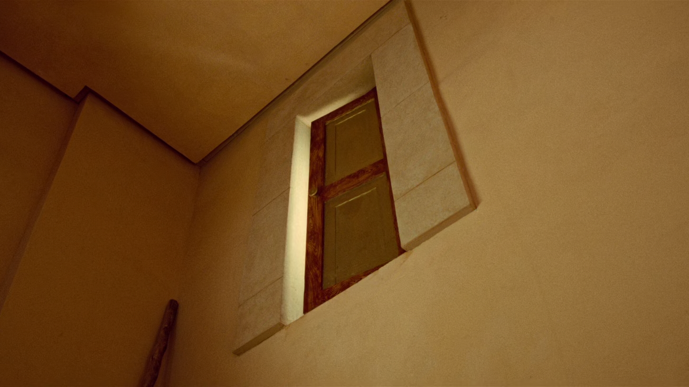

<!--
theme: custom-marp-theme
size: 16:9
paginate: true
author: L. Delafontaine, avec l'aide de GitHub Copilot
title: HEIG-VD ProgServ2 Course - Projet libre
description: Projet libre pour l'unité d'enseignement ProgServ2 enseigné à la HEIG-VD, Suisse
url: https://heig-vd-progserv-course.github.io/heig-vd-ProgServ2-course/01.01-modalites-de-lunite-denseignement/01-supports-de-cours/index.html
header: "**Projet libre**"
footer: '[**HEIG-VD**](https://heig-vd.ch) - [ProgServ2 2025-2026](https://github.com/heig-vd-progserv-course/heig-vd-progserv2-course) - [CC BY-SA 4.0](https://github.com/heig-vd-progserv-course/heig-vd-progserv2-course/blob/main/LICENSE.md)'
headingDivider: 6
math: mathjax
-->

# Projet libre

<!--
_class: lead
_paginate: false
-->

[Lien vers le cours][cours]

<small>L. Delafontaine, avec l'aide de
[GitHub Copilot](https://github.com/features/copilot).</small>

<small>Ce travail est sous licence [CC BY-SA 4.0][license].</small>

![bg opacity:0.1][illustration-principale]

## _Retrouvez plus de détails dans le support de cours_

<!-- _class: lead -->

_Cette présentation est un résumé du support de cours. Pour plus de détails,
consultez le [support de cours][cours]._

## Objectifs

- Réaliser une application web complète, incluant une interface utilisateur, une
  logique métier et une persistance des données.
- Gérer correctement l'authentification et les accès aux différentes pages.
- Déployer et accéder à l'application web depuis Internet.

![bg right:40%][illustration-objectifs]

## Composition des groupes

- Deux (2) ou trois (3) personnes par groupe.
- Si vous n'avez pas de partenaire, le corps enseignant vous en attribuera un.e.
- Groupes à annoncer dans un document Google Sheets, comme décrit dans le
  [support de cours][cours].

![bg right:40%][illustration-composition-des-groupes]

## Validation de l'idée

- Nous pourrions vous demander de modifier votre idée si elle est trop simple ou
  trop complexe.
- Nous vous aiderons à trouver une bonne idée si nécessaire.
- Un cahier des charges est attendu dans les deux premières semaines du projet
  Les détails sont dans le [support de cours][cours].

![bg right:40%][illustration-validation-de-lidee]

## Critères d'évaluation

Sur la base de critères bien définis et d'une échelle à trois points :

- 0 point - Le travail est manquant, hors sujet ou montre une compréhension très
  limitée du sujet.
- 1 point - Le travail montre une compréhension partielle : certains éléments
  clés sont manquants, peu clairs ou mal mis en œuvre.
- 2 points - Le travail est complet, précis et montre une compréhension claire
  et approfondie du sujet.

$\text{Note du projet} =\frac{\text{Nombre de points obtenus}}{\text{Nombre de points totaux}} * 5 + 1$

## Contraintes (1/2)

- Toute l'équipe doit contribuer au projet. Dans des cas exceptionnels,
  l'appréciation peut être individuelle.
- Le projet respecte le cahier des charges initial.
- Le projet doit être terminé et remis selon les instructions indiquées dans la
  section [Soumission](#soumission-12).
- Le projet est réalisé en PHP, avec une base de données MySQL/MariaDB, sans
  utiliser de frameworks externes.
- Le projet doit respecter les bonnes pratiques étudiées et acquises jusqu'ici.
  Voir
  [Programmation serveur 1 (ProgServ1)](https://github.com/heig-vd-progserv-course/heig-vd-progserv1-course/tree/main).

## Contraintes (2/2)

- Vous devez indiquer vos sources si vous avez utilisé des éléments dont vous
  n'êtes pas l'auteur.trice. Vous devez également indiquer dans votre rapport
  final à quelles fins vous avez utilisé la ou les sources/outils.
- Le plagiat entraîne la note de 1. Si plusieurs groupes sont impliqués, tous
  les groupes impliqués recevront une note de 1.

Le non-respect de ces contraintes peut entraîner des sanctions sévères, et ce,
**pour chaque critère non respecté**.

## Soumission (1/2)

Les dates de rendu de votre projet sont les suivantes :

- ProgServ2-A (mardi matin) : **21.12.2025 12h00**.
- ProgServ2-B (mardi après-midi) : **21.12.2025 16h15**.

## Soumission (2/2)

Un e-mail doit être envoyé à
[`ludovic.delafontaine@heig-vd.ch`](mailto:ludovic.delafontaine@heig-vd.ch)
contenant une archive ZIP ou le lien vers un dépôt Git contenant :

- Le code source de votre projet.
- Le rapport contenant le cahier des charges et une conclusion au format PDF,
  comme indiqué dans la section [Validation de l'idée](#validation-de-lidée).

Tou.tes les membres du groupe sont mis.es en copie du mail.

**Chaque 24h de retard (dès une (1) minute après l'heure de rendu) entraînera
une pénalité de -1 point sur la note finale.**

## Notes et retours

Les notes seront saisies dans GAPS, puis envoyées par e-mail avec les retours.

L'évaluation utilisera exactement la même grille de notation que celle indiquée
dans le [support de cours][cours].

Chaque critère sera accompagné d'un commentaire expliquant les points obtenus,
d'un commentaire général sur votre travail et de la note finale.

Si vous avez des questions concernant l'évaluation, n'hésitez pas !

## Conseils

<!-- _class: lead -->

### Restez simple

Évitez les fonctionnalités superflues :

- N'essayez pas d'en faire trop.
- Concentrez-vous sur l'essentiel.
- Faites-le bien.

Ne soyez pas Numérobis du film _Astérix et Obélix : Mission Cléopâtre_ !

<small>Regardez la scène du film ici :
[YouTube](https://www.youtube.com/watch?v=dEP7aEyTOf0)</small>

### Mettez en place un environnement de travail collaboratif

- Utilisez des outils de gestion de projet (GitHub, Trello, etc. pour organiser
  votre travail).
- Assurez-vous que chaque membre du groupe a ses tâches et responsabilités.
- Des ressources sont disponibles dans le [support de cours][cours].

## Questions

<!-- _class: lead -->

Est-ce que vous avez des questions ?

## Jalons

- Réunions hebdomadaires pour discuter de l'avancement.
- Espace pour faire le point.
- Court et efficace (5-10 minutes) :
  - Tour de table.
  - Réponses aux éventuels questions/besoins.
- Part intégrante à la note finale.

![bg right:40%][illustration-jalons]

### Jalon 1

A faire avant le prochain cours :

- ✅ Constitution et annonces des groupes.
- ✅ Choix du projet et de ses fonctionnalités.
- ✅ Élaboration initiale du cahier des charges (brouillon).

**Ce jalon ne compte pas dans l'évaluation finale.**

### Jalon 2

- Tour de table - validation du travail effectué jusqu'à présent.
- Réponses aux éventuels questions/besoins.

A faire pour le prochain cours :

- ✅ Finaliser le cahier des charges.
- ✅ Mettre en place son environnement de travail collaboratif.
- ✅ Se répartir le travail entre les différents membres du groupe.

### Jalon 3

- Tour de table - validation du travail effectué jusqu'à présent.
- Réponses aux éventuels questions/besoins.

A faire pour le prochain cours :

- ✅ Avoir mis en place une base de données pour l'application.
- ✅ Avoir une version déployée de l'application sur Internet.
- ✅ Avoir commencé à implémenter les pages principales de l'application.

### Jalon 4

- Tour de table - validation du travail effectué jusqu'à présent.
- Réponses aux éventuels questions/besoins.

A faire pour le prochain cours :

- ✅ Mettre en place la gestion multilingue à l'aide d'un cookie.

#### ProgServ2-A (mardi matin) (1/2)

|   # | Groupe                   | Heure de passage |
| --: | :----------------------- | :--------------- |
|   1 | Matteo, Ella, Aïdan (4)  | 10h30            |
|   2 | Lilou, Aissya (8)        | 10h40            |
|   3 | Luka, Nabil, Mathias (5) | 10h50            |
|   4 | Léa, Grégory (9)         | 11h00            |
|   5 | Marc, Ana, Charline (7)  | 11h10            |
|   6 | Inês, Rania (3)          | 11h20            |

#### ProgServ2-A (mardi matin) (2/2)

|   # | Groupe                   | Heure de passage |
| --: | :----------------------- | :--------------- |
|   7 | Luca, Sacha, Ryad (1)    | 11h30            |
|   8 | Pierre, Raul, Romain (2) | 11h40            |
|   9 | Carla, Cindy, Steve (6)  | 11h50            |

#### ProgServ2-B (mardi après-midi) (1/2)

|   # | Groupe                        | Heure de passage |
| --: | :---------------------------- | :--------------- |
|   1 | Christophe, Loic, Loriane (5) | 14h45            |
|   2 | Sarah, Sasita, Enya (1)       | 14h55            |
|   3 | Inoé, Léa, Yannis (8)         | 15h05            |
|   4 | Gabriel, Nuno, Tanguy (2)     | 15h15            |
|   5 | Chloé, Benoît, Camilo (6)     | 15h25            |
|   6 | Thierry, Lilliana (3)         | 15h35            |

#### ProgServ2-B (mardi après-midi) (2/2)

|   # | Groupe                  | Heure de passage |
| --: | :---------------------- | :--------------- |
|   7 | Etienne, Teicir (7)     | 15h45            |
|   8 | Dylan, Valentin (4)     | 15h55            |
|   9 | Loann, Elia, Marike (9) | 16h05            |

### Jalon 5

- Tour de table - validation du travail effectué jusqu'à présent.
- Réponses aux éventuels questions/besoins.

A faire pour le prochain cours :

- ✅ Avoir commencé à mettre en place le système d'authentification.

### Jalon 6

- Tour de table - validation du travail effectué jusqu'à présent.
- Réponses aux éventuels questions/besoins.

A faire pour le prochain cours :

- ✅ Finaliser le système d'authentification avec envoi de mails.

### Jalon 7

- Tour de table - validation du travail effectué jusqu'à présent.
- Réponses aux éventuels questions/besoins.
- S'assurer que tout le monde a bien tout ce qu'il lui faut pour finaliser le
  projet.

A faire pour le prochain cours :

- ✅ Arriver gentiment au bout de l'application.
- ✅ Réviser pour l'évaluation.

### Jalon 8

- Réponses aux éventuels questions/besoins.
- S'assurer que tout le monde a bien tout ce qu'il lui faut pour finaliser le
  projet.

A faire pour le rendu final :

- ✅ Avoir terminé l'application.
- ✅ Rendre le projet en respectant la forme du rendu final.

**Ce jalon ne compte pas dans l'évaluation finale.**

## Sources

- [Illustration principale][illustration-principale] par
  [Richard Jacobs](https://unsplash.com/@rj2747) sur
  [Unsplash](https://unsplash.com/photos/grayscale-photo-of-elephants-drinking-water-8oenpCXktqQ)
- [Illustration][illustration-objectifs] par
  [Aline de Nadai](https://unsplash.com/@alinedenadai) sur
  [Unsplash](https://unsplash.com/photos/low-angle-view-of-ball-shoots-in-the-ring-j6brni7fpvs)
- [Illustration][illustration-composition-des-groupes] par
  [Nguyen Dang Hoang Nhu](https://unsplash.com/@nguyendhn) sur
  [Unsplash](https://unsplash.com/photos/person-writing-on-white-paper-qDgTQOYk6B8)
- [Illustration][illustration-composition-des-groupes] par
  [Josh Calabrese](https://unsplash.com/@joshcala) sur
  [Unsplash](https://unsplash.com/photos/five-men-riding-row-boat-Ev1XqeVL2wI)
- [Illustration][illustration-validation-de-lidee] par
  [Nicole Baster](https://unsplash.com/@nicolebaster) sur
  [Unsplash](https://unsplash.com/photos/traffic-light-aGx-CFsM3fE)
- Scène du film _Astérix et Obélix : Mission Cléopâtre (2002)_ par Alain Chabat
- [Illustration][illustration-jalons] par
  [Nick Fewings](https://unsplash.com/@jannerboy62) sur
  [Unsplash](https://unsplash.com/photos/gray-spiral-staircase-with-brown-wooden-railings-0920v3yp79k)

<!-- URLs -->

[cours]:
	https://github.com/heig-vd-progserv-course/heig-vd-progserv2-course/tree/main/01.03-projet-libre-(1-sur-8)
[license]:
	https://github.com/heig-vd-progserv-course/heig-vd-ProgServ2-course/blob/main/LICENSE.md

<!-- Illustrations -->

[illustration-principale]:
	https://images.unsplash.com/photo-1517486430290-35657bdcef51?fit=crop&h=720
[illustration-objectifs]:
	https://images.unsplash.com/photo-1516389573391-5620a0263801?fit=crop&h=720
[illustration-composition-des-groupes]:
	https://images.unsplash.com/photo-1491911923017-19f90d8d7f83?fit=crop&h=720
[illustration-validation-de-lidee]:
	https://images.unsplash.com/photo-1543075137-5a97903aaa7a?fit=crop&h=720
[illustration-jalons]:
	https://images.unsplash.com/photo-1617890085410-2cc61f307318?fit=crop&h=720
