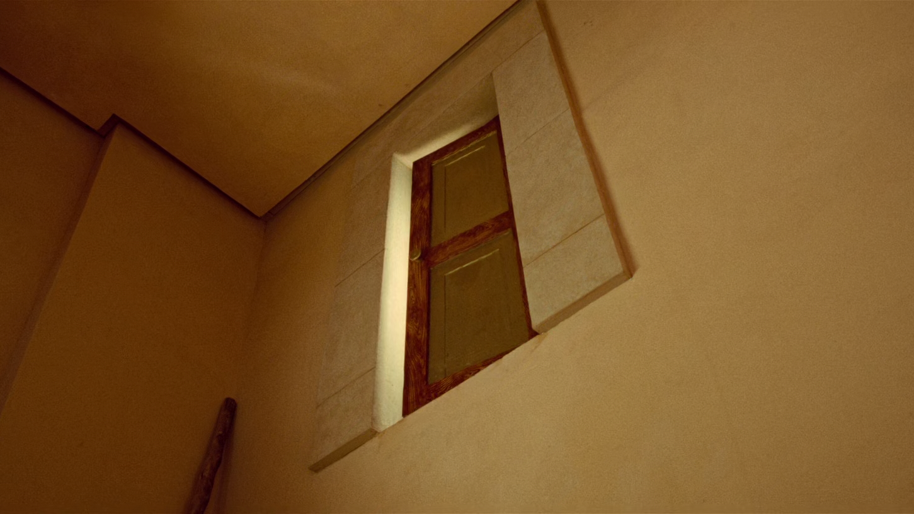

<!--
theme: custom-marp-theme
size: 16:9
paginate: true
author: L. Delafontaine, avec l'aide de GitHub Copilot
title: HEIG-VD ProgServ2 Course - Projet libre
description: Projet libre pour le cours ProgServ2 enseigné à la HEIG-VD, Suisse
url: https://heig-vd-progserv-course.github.io/heig-vd-ProgServ2-course/02-evaluations/02-projet-libre/presentation.html
header: "**Projet libre**"
footer: '[**HEIG-VD**](https://heig-vd.ch) - [ProgServ2 2025-2026](https://github.com/heig-vd-progserv-course/heig-vd-progserv2-course) - [CC BY-SA 4.0](https://github.com/heig-vd-progserv-course/heig-vd-progserv2-course/blob/main/LICENSE.md)'
headingDivider: 6
math: mathjax
-->

# Projet libre

<!--
_class: lead
_paginate: false
-->

[ `github.com/heig-vd-progserv-course/heig-vd-progserv2-course`](https://github.com/heig-vd-progserv-course/heig-vd-progserv2-course)

[Visualiser le contenu complet sur GitHub][contenu-complet].

<small>L. Delafontaine, avec l'aide de
[GitHub Copilot](https://github.com/features/copilot).</small>

<small>Ce travail est sous licence [CC BY-SA 4.0][license].</small>

![bg opacity:0.1][illustration-principale]

## Retrouvez le contenu complet de cette présentation sur GitHub

<!-- _class: lead -->

_Cette présentation est un résumé du contenu complet disponible sur GitHub._

_Pour plus de détails, retrouvez le contenu complet [ici][contenu-complet] ou en
cliquant sur l'en-tête de ce document._

## Objectifs (1/2)

- Réaliser une application web complète, incluant une interface utilisateur, une
  logique métier et une persistance des données.
- Gérer correctement l'authentification et les accès aux différentes pages.
- Déployer et accéder à l'application web depuis Internet.

![bg right:40%][illustration-objectifs]

## Objectifs (2/2)

- Vous pouvez être créatif.ve !
- Vous pouvez proposer une application web originale.
- Ou vous inspirer d'applications web existantes et les améliorer ou les adapter
  à vos besoins.

**Laissez libre cours à votre imagination !**

![bg right:40%][illustration-objectifs]

## Composition des groupes

- Deux (2) ou trois (3) personnes par groupe.
- Si vous n'avez pas de partenaire, le corps enseignant vous en attribuera un.e.
- Groupes à annoncer dans un document Google Sheets, comme décrit dans le
  [support de cours][contenu-complet].

![bg right:40%][illustration-composition-des-groupes]

## Validation de l'idée

- Nous pourrions vous demander de modifier votre idée si elle est trop simple ou
  trop complexe.
- Nous vous aiderons à trouver une bonne idée si nécessaire.
- Un cahier des charges est attendu dans les deux premières semaines du projet
  Les détails sont dans le [support de cours][contenu-complet].

![bg right:40%][illustration-validation-de-lidee]

## Travail à réaliser

- Une application web complète avec PHP, incluant une interface utilisateur, une
  logique métier et une persistance des données.
- Rendu sur un dépôt GitHub avec un README détaillé.
- Un template vous est fourni pour vous aider à démarrer, mais vous êtes libre
  de l'adapter à vos besoins.

![bg right:40%][illustration-principale]

## Présentation du projet

- Une présentation de votre projet sera faite devant le corps enseignant.
- Tous les membres du groupe doivent participer à la présentation.

![bg right:40%][illustration-principale]

## Échelle d'évaluation, grilles d'évaluation, contraintes, soumission et notes et retours

<!-- _class: lead -->

Voir le [support de cours][contenu-complet] pour plus de détails.

## Conseils

<!-- _class: lead -->

### Restez simple

Évitez les fonctionnalités superflues :

- N'essayez pas d'en faire trop.
- Concentrez-vous sur l'essentiel.
- Faites-le bien.

Ne soyez pas Numérobis du film _Astérix et Obélix : Mission Cléopâtre_ !

<small>Voir la scène du film ici :
[YouTube](https://www.youtube.com/watch?v=dEP7aEyTOf0).</small>

### Mettez en place un environnement de travail collaboratif

- Utilisez des outils de gestion de projet (GitHub, Trello, etc.) pour organiser
  votre travail.
- Assurez-vous que chaque membre du groupe a ses tâches et responsabilités.

## Questions

<!-- _class: lead -->

Est-ce que vous avez des questions ?

## Sources

- [Illustration principale][illustration-principale] par
  [Richard Jacobs](https://unsplash.com/@rj2747) sur
  [Unsplash](https://unsplash.com/photos/grayscale-photo-of-elephants-drinking-water-8oenpCXktqQ)
- [Illustration][illustration-objectifs] par
  [Aline de Nadai](https://unsplash.com/@alinedenadai) sur
  [Unsplash](https://unsplash.com/photos/low-angle-view-of-ball-shoots-in-the-ring-j6brni7fpvs)
- [Illustration][illustration-composition-des-groupes] par
  [Nguyen Dang Hoang Nhu](https://unsplash.com/@nguyendhn) sur
  [Unsplash](https://unsplash.com/photos/person-writing-on-white-paper-qDgTQOYk6B8)
- [Illustration][illustration-composition-des-groupes] par
  [Josh Calabrese](https://unsplash.com/@joshcala) sur
  [Unsplash](https://unsplash.com/photos/five-men-riding-row-boat-Ev1XqeVL2wI)
- [Illustration][illustration-validation-de-lidee] par
  [Nicole Baster](https://unsplash.com/@nicolebaster) sur
  [Unsplash](https://unsplash.com/photos/traffic-light-aGx-CFsM3fE)
- Scène du film _Astérix et Obélix : Mission Cléopâtre (2002)_ par Alain Chabat
- [Illustration][illustration-jalons] par
  [Nick Fewings](https://unsplash.com/@jannerboy62) sur
  [Unsplash](https://unsplash.com/photos/gray-spiral-staircase-with-brown-wooden-railings-0920v3yp79k)

<!-- URLs -->

[contenu-complet]:
	https://github.com/heig-vd-progserv-course/heig-vd-progserv2-course/tree/main/02-evaluations/02-projet-libre/README.md
[license]:
	https://github.com/heig-vd-progserv-course/heig-vd-ProgServ2-course/blob/main/LICENSE.md

<!-- Illustrations -->

[illustration-principale]:
	https://images.unsplash.com/photo-1517486430290-35657bdcef51?fit=crop&h=720
[illustration-objectifs]:
	https://images.unsplash.com/photo-1516389573391-5620a0263801?fit=crop&h=720
[illustration-composition-des-groupes]:
	https://images.unsplash.com/photo-1491911923017-19f90d8d7f83?fit=crop&h=720
[illustration-validation-de-lidee]:
	https://images.unsplash.com/photo-1543075137-5a97903aaa7a?fit=crop&h=720
[illustration-jalons]:
	https://images.unsplash.com/photo-1617890085410-2cc61f307318?fit=crop&h=720
