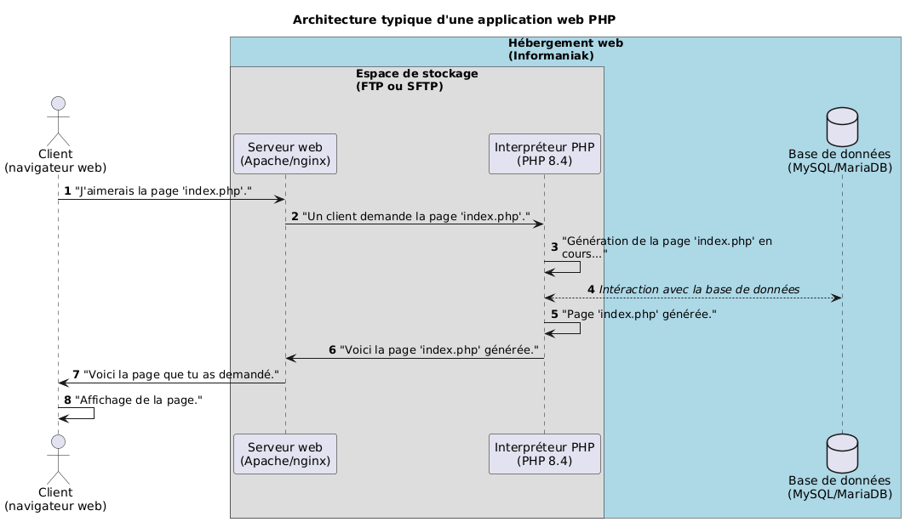

<!--
theme: custom-marp-theme
size: 16:9
paginate: true
author: L. Delafontaine, avec l'aide de GitHub Copilot
title: HEIG-VD ProgServ2 Course - Déploiement
description: Déploiement pour l'unité d'enseignement ProgServ2 enseigné à la HEIG-VD, Suisse
url: https://heig-vd-progserv-course.github.io/heig-vd-progserv2-course/03.01-deploiement/01-supports-de-cours/index.html
header: "[**Déploiement**](https://github.com/heig-vd-progserv-course/heig-vd-progserv2-course/blob/main/03.01-deploiement)"
footer: '[**HEIG-VD**](https://heig-vd.ch) - [ProgServ2 2025-2026](https://github.com/heig-vd-progserv-course/heig-vd-progserv2-course) - [CC BY-SA 4.0](https://github.com/heig-vd-progserv-course/heig-vd-progserv2-course/blob/main/LICENSE.md)'
headingDivider: 6
math: mathjax
-->

# Déploiement

<!--
_class: lead
_paginate: false
-->

[Lien vers le cours][cours]

<small>L. Delafontaine, avec l'aide de
[GitHub Copilot](https://github.com/features/copilot).</small>

<small>Ce travail est sous licence [CC BY-SA 4.0][license].</small>

![bg opacity:0.1][illustration-principale]

## _Retrouvez plus de détails dans le support de cours_

<!-- _class: lead -->

_Cette présentation est un résumé du support de cours. Pour plus de détails,
consultez le [support de cours][cours]._

## Objectifs

- Déployer une application web PHP sur un serveur web.
- Configurer un environnement de production sécurisé.

![bg right:40%][illustration-objectifs]

## Architecture typique d'une application web PHP

- Un serveur web pour gérer les requêtes HTTP.
- Un interpréteur PHP pour exécuter le code PHP.
- Une base de données pour stocker les données.
- Un espace de stockage pour stocker les fichiers de l'application.

---

### Serveur web

- Gère les requêtes HTTP.
- Distribue les ressources (fichiers HTML, CSS, JavaScript, images, etc.).
- Exemples : Apache, Nginx.

### Interpréteur PHP

- Exécute le code PHP.
- Génère du contenu dynamique.
- Communique avec la base de données.

### Base de données

- Stocke les données de l'application.
- Exemples : MySQL/MariaDB, PostgreSQL, SQLite.

### Espace de stockage

- Stocke les fichiers de l'application.
- Exemples : FTP, SFTP, stockage en ligne.

## Hébergement

- Services pour héberger une application web PHP.
- Fournit le serveur web, l'interpréteur PHP, la base de données et l'espace de
  stockage.
- Exemples : Infomaniak, OVH, AWS, DigitalOcean.

### Infomaniak comme hébergeur

- Hébergeur suisse populaire.
- Offre des services adaptés aux applications PHP.
- Offre un programme étudiant pour des hébergements gratuits.

## Déployer une application PHP

- Consiste à transférer les fichiers de l'application vers le serveur web.
- Configurer l'environnement de production.

![bg right:40%][illustration-principale]

### Transfert via FTP/SFTP

- FTP (File Transfer Protocol) et SFTP (SSH File Transfer Protocol) sont des
  protocoles pour transférer des fichiers.
- Nécessite un client FTP/SFTP (ex. FileZilla sur Windows/Linux ou Cyberduck sur
  macOS).
- Utiliser les informations de connexion fournies par l'hébergeur.

## Sécuriser une application PHP

- Important pour protéger les données et les utilisateurs.
- Mettre en place des mesures de sécurité.

![bg right:40%][illustration-securiser-une-application-php]

### Restreindre les accès grâce aux fichiers `.htaccess`

- Fichiers de configuration pour le serveur web Apache.
- Permettent de restreindre l'accès à certains fichiers ou répertoires.
- Utilisé pour protéger les fichiers sensibles (ex. fichiers de configuration,
  répertoires privés).

![bg right:40%][illustration-securiser-une-application-php]

### Utilisation de HTTPS

- HTTPS est une version sécurisée de HTTP.
- Utilise SSL/TLS pour chiffrer les communications entre le client et le
  serveur.
- Protège les données sensibles (ex. informations de connexion, données
  personnelles).
- Infomaniak propose des certificats SSL gratuits via Let's Encrypt.

![bg right:40%][illustration-securiser-une-application-php]

## Conclusion

- Le déploiement d'une application web PHP nécessite la compréhension de son
  architecture, le choix d'un hébergeur, le transfert des fichiers et la mise en
  place de mesures de sécurité.
- Infomaniak est un bon choix pour héberger des applications PHP.

![bg right:40%][illustration-principale]

## Questions

<!-- _class: lead -->

Est-ce que vous avez des questions ?

## À vous de jouer !

- (Re)lire le support de cours.
- Explorer les exemples de code.
- Faire les exercices.
- Poser des questions si nécessaire.

➡️ [Lien vers le cours][cours]

**N'hésitez pas à vous entraidez si vous avez des difficultés !**

![bg right:40%][illustration-a-vous-de-jouer]

## Sources

- [Illustration principale][illustration-principale] par
  [Richard Jacobs](https://unsplash.com/@rj2747) sur
  [Unsplash](https://unsplash.com/photos/grayscale-photo-of-elephants-drinking-water-8oenpCXktqQ)
- [Illustration][illustration-objectifs] par
  [Aline de Nadai](https://unsplash.com/@alinedenadai) sur
  [Unsplash](https://unsplash.com/photos/low-angle-view-of-ball-shoots-in-the-ring-j6brni7fpvs)
- [Illustration][illustration-securiser-une-application-php] par
  [John Salvino](https://unsplash.com/@jsalvino) sur
  [Unsplash](https://unsplash.com/photos/gray-steel-chain-locked-on-gate-bqGBbLq_yfc)
- [Illustration][illustration-a-vous-de-jouer] par
  [Nikita Kachanovsky](https://unsplash.com/@nkachanovskyyy) sur
  [Unsplash](https://unsplash.com/photos/white-sony-ps4-dualshock-controller-over-persons-palm-FJFPuE1MAOM)

<!-- URLs -->

[cours]:
	https://github.com/heig-vd-progserv-course/heig-vd-progserv2-course/tree/main/03.01-deploiement
[license]:
	https://github.com/heig-vd-progserv-course/heig-vd-progserv2-course/blob/main/LICENSE.md

<!-- Illustrations -->

[illustration-principale]:
	https://images.unsplash.com/photo-1517486430290-35657bdcef51?fit=crop&h=720
[illustration-objectifs]:
	https://images.unsplash.com/photo-1516389573391-5620a0263801?fit=crop&h=720
[illustration-securiser-une-application-php]:
	https://images.unsplash.com/photo-1508345228704-935cc84bf5e2?fit=crop&h=720
[illustration-a-vous-de-jouer]:
	https://images.unsplash.com/photo-1509198397868-475647b2a1e5?fit=crop&h=720
