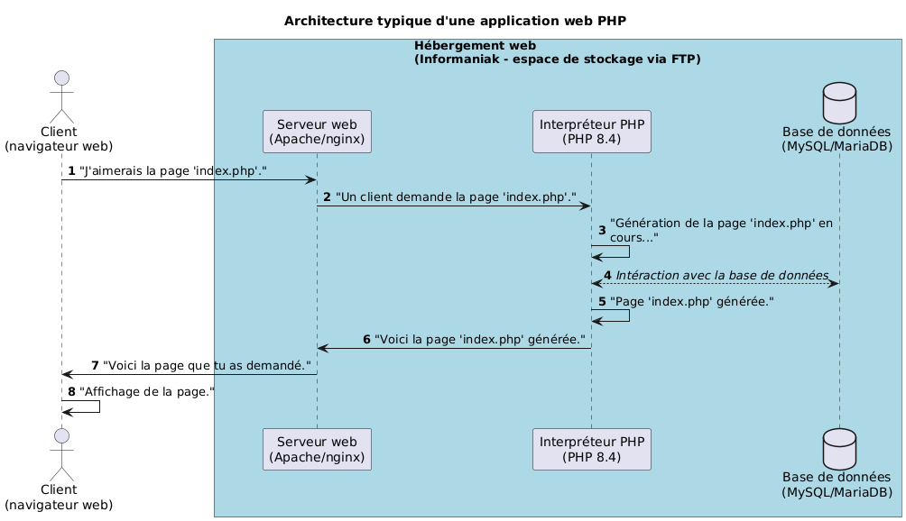

# Déploiement - Support de cours

L. Delafontaine, avec l'aide de
[GitHub Copilot](https://github.com/features/copilot).

Ce travail est sous licence [CC BY-SA 4.0][licence].

## Ressources annexes

- Objectifs, méthodes d'enseignement et d'apprentissage, et méthodes
  d'évaluation : [Lien vers le contenu](..)
- Autres formes du support de cours :
  [Presentation (web)](https://heig-vd-progserv-course.github.io/heig-vd-progserv2-course/03.01-deploiement/01-supports-de-cours/index.html)
  ·
  [Presentation (PDF)](https://heig-vd-progserv-course.github.io/heig-vd-progserv2-course/03.01-deploiement/01-supports-de-cours/03.01-deploiement-presentation.pdf)traefik.nortalle.ch
- Exemples de code : [Lien vers le contenu](../02-exemples-de-code/)
- Exercices : [Lien vers le contenu](../03-exercices/README.md)

## Table des matières

- [Ressources annexes](#ressources-annexes)
- [Table des matières](#table-des-matières)
- [Objectifs](#objectifs)
- [Architecture typique d'une application web PHP](#architecture-typique-dune-application-web-php)
  - [Serveur web](#serveur-web)
  - [Interpréteur PHP](#interpréteur-php)
  - [Base de données](#base-de-données)
  - [Espace de stockage](#espace-de-stockage)
- [Hébergement](#hébergement)
  - [Infomaniak comme hébergeur](#infomaniak-comme-hébergeur)
- [Déployer une application PHP](#déployer-une-application-php)
  - [Transfert via FTP/SFTP](#transfert-via-ftpsftp)
- [Sécuriser une application PHP](#sécuriser-une-application-php)
  - [Restreindre les accès grâce aux fichiers `.htaccess`](#restreindre-les-accès-grâce-aux-fichiers-htaccess)
  - [Utilisation de HTTPS](#utilisation-de-https)
- [Conclusion](#conclusion)
- [Exemples de code](#exemples-de-code)
- [Exercices](#exercices)

## Objectifs

- Déployer une application web PHP sur un serveur web.
- Configurer un environnement de production sécurisé.

## Architecture typique d'une application web PHP

Une architecture typique d'une application web PHP comprend les composants
suivants :

- Un serveur web (comme Apache ou Nginx) pour gérer les requêtes HTTP.
- Un interpréteur PHP pour exécuter le code PHP.
- Une base de données (comme MySQL ou PostgreSQL) pour stocker les données.
- Un espace de stockage pour stocker les fichiers de l'application.

### Serveur web

Le serveur web est responsable de la gestion des requêtes HTTP et de la
distribution des ressources (fichiers HTML, CSS, JavaScript, images, etc.) aux
clients (navigateurs web). Il peut également gérer la communication avec
l'interpréteur PHP pour exécuter le code PHP et générer des pages web
dynamiques.

Il existe plusieurs serveurs web populaires, notamment Apache et Nginx. Ces
serveurs web peuvent être configurés pour fonctionner avec PHP via différents
modules.

### Interpréteur PHP

L'interpréteur PHP est un programme qui lit et exécute le code PHP. Il peut être
intégré au serveur web ou fonctionner comme un processus séparé. L'interpréteur
PHP traite les requêtes entrantes, exécute le code PHP et renvoie les résultats
au serveur web pour qu'ils soient envoyés au client.

### Base de données

La base de données est utilisée pour stocker et gérer les données de
l'application. Elle permet de stocker des informations telles que les
utilisateurs, les produits, les commandes, etc.

Les bases de données relationnelles comme MySQL et PostgreSQL sont couramment
utilisées avec les applications PHP.

### Espace de stockage

L'espace de stockage est utilisé pour stocker les fichiers de l'application,
tels que les fichiers PHP, les fichiers de configuration, les images, les
documents, etc. Il est important de gérer correctement les permissions d'accès
aux fichiers pour assurer la sécurité de l'application.

De façon traditionnelle, les fichiers de l'application sont transférés sur le
serveur via FTP/SFTP où le transfert est effectué à la main. Dans un contexte
professionnel, le transfert est automatisé via des outils de déploiement continu
(CI/CD) qui ne sont pas abordés dans cette unité d'enseignement.

## Hébergement

L'hébergement est le service qui permet de rendre une application web accessible
sur Internet. Il existe plusieurs types d'hébergement, notamment l'hébergement
partagé, l'hébergement VPS (Virtual Private Server) et l'hébergement dédié.

Dans le contexte de cette unité d'enseignement, nous utilisons Infomaniak comme
hébergeur.

### Infomaniak comme hébergeur

Infomaniak est un hébergeur web suisse qui propose des services d'hébergement
partagé, VPS et dédié. Il offre également des services de nom de domaine, de
certificats SSL, de messagerie électronique, etc.

Infomaniak propose un programme étudiant qui permet aux étudiants de bénéficier
d'un hébergement web gratuit pendant une année. Ce programme est idéal pour
déployer des applications web PHP dans le cadre de cette unité d'enseignement.

Il existe de nombreux autres hébergeurs web qui proposent des services
similaires, notamment OVH, DigitalOcean, AWS, etc.

## Déployer une application PHP

Le déploiement d'une application PHP consiste à transférer les fichiers de
l'application sur le serveur web et à configurer l'environnement de production.

### Transfert via FTP/SFTP

Le transfert via FTP (File Transfer Protocol) ou SFTP (SSH File Transfer
Protocol) est une méthode courante pour transférer les fichiers de l'application
sur le serveur web. FTP est un protocole non sécurisé, tandis que SFTP utilise
une connexion SSH sécurisée.

Afin de transférer les fichiers via FTP/SFTP, vous aurez besoin des informations
de connexion fournies par votre hébergeur, telles que l'adresse du serveur, le
nom d'utilisateur et le mot de passe et d'un client FTP/SFTP comme FileZilla
(Windows/Linux) ou Cyberduck (macOS).

## Sécuriser une application PHP

La sécurité est un aspect crucial du déploiement d'une application web PHP. Il
est important de mettre en place des mesures de sécurité pour protéger
l'application et les données des utilisateurs.

### Restreindre les accès grâce aux fichiers `.htaccess`

Les fichiers `.htaccess` sont des fichiers de configuration utilisés par le
serveur web Apache. Ils permettent de définir des règles de configuration
spécifiques pour un répertoire donné.

Les fichiers `.htaccess` peuvent être utilisés pour restreindre l'accès à
certaines parties de l'application, rediriger les requêtes, configurer les pages
d'erreur personnalisées, etc.

### Utilisation de HTTPS

HTTPS (Hypertext Transfer Protocol Secure) est une version sécurisée du
protocole HTTP. Il utilise le protocole SSL/TLS pour chiffrer les communications
entre le client (navigateur web) et le serveur web. L'utilisation de HTTPS est
essentielle pour protéger les données sensibles, telles que les informations de
connexion et les données personnelles des utilisateurs.

Grâce à HTTPS, les données échangées entre le client et le serveur sont
chiffrées, ce qui empêche les attaquants d'intercepter et de lire ces données.

Infomaniak propose des certificats gratuits, ce qui facilite la mise en place de
sites web sécurisés.

## Conclusion

Le déploiement d'une application web PHP sur un serveur web nécessite la
compréhension de l'architecture typique d'une application web PHP, la sélection
d'un hébergeur approprié, le transfert des fichiers de l'application et la mise
en place de mesures de sécurité.

Dans les exercices, nous vous guiderons à travers le processus de déploiement
d'une application PHP simple sur Infomaniak, en utilisant le programme étudiant.

## Exemples de code

Nous vous invitons maintenant à consulter les exemples de code du cours afin de
vous familiariser avec les concepts abordés.

Vous trouverez les exemples de code ici :
[Exemples de code](../02-exemples-de-code/).

## Exercices

Nous vous invitons ensuite à réaliser les exercices du cours afin de mettre en
pratique les concepts abordés.

Vous trouverez les exercices ici : [Exercices](../03-exercices/README.md).

[licence]:
	https://github.com/heig-vd-progserv-course/heig-vd-progserv2-course/blob/main/LICENSE.md
