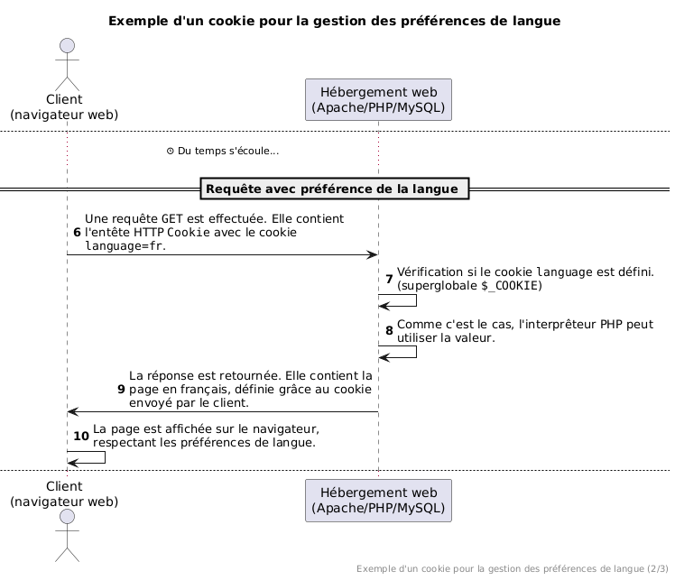

<!--
theme: custom-marp-theme
size: 16:9
paginate: true
author: L. Delafontaine, avec l'aide de GitHub Copilot
title: HEIG-VD ProgServ2 Course - Cookies, préférences, et gestion multilingues (i18n)
description: Cookies, préférences, et gestion multilingues (i18n) pour l'unité d'enseignement ProgServ2 enseigné à la HEIG-VD, Suisse
url: https://heig-vd-progserv-course.github.io/heig-vd-progserv2-course/03.01-deploiement/01-supports-de-cours/index.html
header: "**Cookies, préférences, et gestion multilingues (i18n)**"
footer: '[**HEIG-VD**](https://heig-vd.ch) - [ProgServ2 2025-2026](https://github.com/heig-vd-progserv-course/heig-vd-progserv2-course) - [CC BY-SA 4.0](https://github.com/heig-vd-progserv-course/heig-vd-progserv2-course/blob/main/LICENSE.md)'
headingDivider: 6
math: mathjax
-->

# Cookies, préférences, et gestion multilingues (i18n)

<!--
_class: lead
_paginate: false
-->

[Lien vers le cours][cours]

<small>L. Delafontaine, avec l'aide de
[GitHub Copilot](https://github.com/features/copilot).</small>

<small>Ce travail est sous licence [CC BY-SA 4.0][license].</small>

![bg opacity:0.1][illustration-principale]

## _Retrouvez plus de détails dans le support de cours_

<!-- _class: lead -->

_Cette présentation est un résumé du support de cours. Pour plus de détails,
consultez le [support de cours][cours]._

## Objectifs

- Utiliser les cookies pour stocker les préférences des utilisateurs.
- Implémenter la gestion multilingue (i18n) dans une application web PHP.

![bg right:40%][illustration-objectifs]

## Les cookies (1/2)

- Fichiers textes stockés sur le poste client (navigateur).
- Définis par le serveur et envoyés au client via les en-têtes HTTP.
- Renvoyés par le client au serveur avec chaque requête HTTP.
- Permettent de stocker les préférences utilisateur (ex. : langue, thème, etc.).

![bg right:40%][illustration-les-cookies]

## Les cookies (2/2)

- Les cookies ont des attributs comme :
  - Le nom du cookie.
  - Sa valeur.
  - Sa date d'expiration.
  - Et quelques autres options (domaine, chemin, sécurité, etc.).
- Valides pour une durée ou jusqu'à la fermeture du navigateur.

![bg right:40%][illustration-les-cookies]

---


---



---


### Créer des cookies en PHP

```php
<?php
// Définit un cookie 'language'
// avec la valeur 'fr'
// qui expire dans 30 jours.
setcookie(
  'language',
  'fr',
  time() + (30 * 24 * 60 * 60)
);
```

![bg right:40%][illustration-creer-des-cookies-en-php]

### Lire des cookies en PHP

```php
<?php
// Vérifie si le cookie 'language' est défini
if (isset($_COOKIE['language'])) {
    $language = $_COOKIE['language'];
    echo "La langue préférée est : " .
        htmlspecialchars($language);
} else {
    echo "Aucune langue préférée définie.";
}
```

![bg right:40%][illustration-lire-des-cookies-en-php]

### Invalider/supprimer des cookies en PHP

```php
<?php
// Supprime le cookie en le recréant
// avec une date d'expiration dans le passé.
setcookie('language', '', time() - 3600);
```

```php
<?php
// Supprime le cookie en lui
// donnant une valeur vide.
setcookie('language', '');
```

![bg right:40%][illustration-invalider-supprimer-des-cookies-en-php]

### Visualiser les cookies dans le navigateur

- Tous les navigateurs modernes offrent des outils de développement (DevTools)
  pour inspecter les cookies.
- Le [support de cours][cours] détaille comment faire cela dans différents
  navigateurs.


## Gestion multilingue (i18n) (1/2)

- i18n = internationalization (18 lettres entre le _"i"_ et le _"n"_).
- Gestion des langues et des cultures dans une application.
- Plusieurs manières de l'implémenter (fichiers de traduction, bases de données,
  services externes, etc.).

![bg right:40%][illustration-gestion-multilingue-i18n]

## Gestion multilingue (i18n) (2/2)

- Permet aux utilisateurs de choisir leur langue préférée.
- Utilisation de cookies pour mémoriser la langue préférée.

![bg right:40%][illustration-gestion-multilingue-i18n]

### Fichiers de traduction

- Utilisation de fichiers de traduction pour stocker les textes dans différentes
  langues pour cette unité d'enseignement.
- Chaque fichier contient des tableaux associatifs avec les textes d'une langue
  spécifique.
- Un exemple plus complet est disponible dans les codes d'exemples.

![bg right:40%][illustration-gestion-multilingue-i18n]

### Utilisation des fichiers de traduction (1/2)

```php
<?php
// translations.php
$translations = [
    'en' => [
        'welcome' => 'Welcome',
        'hello' => 'Hello',
    ],
    'fr' => [
        'welcome' => 'Bienvenue',
        'hello' => 'Bonjour',
    ],
];
?>
```

### Utilisation des fichiers de traduction (2/2)

```php
<?php
require_once 'translations.php';

// Langue par défaut
const DEFAULT_LANGUAGE = 'en';

// Définit la langue par défaut
$language = DEFAULT_LANGUAGE;

// Vérifie si le cookie de langue est défini et valide
if (isset($_COOKIE['language']) && array_key_exists($_COOKIE['language'], $translations)) {
    // Si le cookie est défini et valide, utilise la langue du cookie
    $language = $_COOKIE['language'];
}

// Exemple d'utilisation
echo $translations[$language]['welcome'];
```

## Conclusion

- Les cookies permettent de stocker les préférences utilisateur.
- Ils sont échangés entre le client et le serveur avec chaque requête HTTP.
- Nous pouvons utiliser des cookies pour mémoriser les préférences de langue.
- La gestion multilingue (i18n) améliore l'expérience utilisateur.

![bg right:40%][illustration-les-cookies]
![bg right:40%][illustration-creer-des-cookies-en-php]
![bg right:40%][illustration-lire-des-cookies-en-php]
![bg right:40% vertical][illustration-invalider-supprimer-des-cookies-en-php]

## Questions

<!-- _class: lead -->

Est-ce que vous avez des questions ?

## À vous de jouer !

- (Re)lire le support de cours.
- Explorer les exemples de code.
- Faire les exercices.
- Poser des questions si nécessaire.

➡️ [Lien vers le cours][cours]

**N'hésitez pas à vous entraidez si vous avez des difficultés !**

![bg right:40%][illustration-a-vous-de-jouer]

## Sources

- [Illustration principale][illustration-principale] par
  [Richard Jacobs](https://unsplash.com/@rj2747) sur
  [Unsplash](https://unsplash.com/photos/grayscale-photo-of-elephants-drinking-water-8oenpCXktqQ)
- [Illustration][illustration-objectifs] par
  [Aline de Nadai](https://unsplash.com/@alinedenadai) sur
  [Unsplash](https://unsplash.com/photos/j6brni7fpvs)
- [Illustration][illustration-les-cookies] par
  [Erol Ahmed](https://unsplash.com/@erol) sur
  [Unsplash](https://unsplash.com/photos/baked-cookies-on-white-concrete-surface-AmzKuEnr1VY)
- [Illustration][illustration-creer-des-cookies-en-php] par
  [Chris Liverani](https://unsplash.com/@shaktirajpurohit) sur
  [Unsplash](https://unsplash.com/photos/brown-cookies-on-white-ceramic-plate-qczubsyHofQ)
- [Illustration][illustration-lire-des-cookies-en-php] par
  [Food Photographer | Jennifer Pallian](https://unsplash.com/@foodess) sur
  [Unsplash](https://unsplash.com/photos/close-up-photo-of-baked-cookies-OfdDiqx8Cz8)
- [Illustration][illustration-invalider-supprimer-des-cookies-en-php] par
  [Tamas Pap](https://unsplash.com/@tamasp) sur
  [Unsplash](https://unsplash.com/photos/chocolate-ice-cream-on-brown-cone-98Kk8vwPbgs)
- [Illustration][illustration-gestion-multilingue-i18n] par
  [NASA](https://unsplash.com/@nasa) sur
  [Unsplash](https://unsplash.com/photos/astronaut-in-spacesuit-floating-in-space-Yj1M5riCKk4)
- [Illustration][illustration-a-vous-de-jouer] par
  [Nikita Kachanovsky](https://unsplash.com/@nkachanovskyyy) sur
  [Unsplash](https://unsplash.com/photos/white-sony-ps4-dualshock-controller-over-persons-palm-FJFPuE1MAOM)

<!-- URLs -->

[cours]:
	https://github.com/heig-vd-progserv-course/heig-vd-progserv2-course/tree/main/03.01-deploiement
[license]:
	https://github.com/heig-vd-progserv-course/heig-vd-progserv2-course/blob/main/LICENSE.md

<!-- Illustrations -->

[illustration-principale]:
	https://images.unsplash.com/photo-1517486430290-35657bdcef51?fit=crop&h=720
[illustration-objectifs]:
	https://images.unsplash.com/photo-1516389573391-5620a0263801?fit=crop&h=720
[illustration-les-cookies]:
	https://images.unsplash.com/photo-1485745655111-3272a37e76a5?fit=crop&h=720
[illustration-creer-des-cookies-en-php]:
	https://images.unsplash.com/photo-1625876981820-be17a6807189?fit=crop&h=720
[illustration-lire-des-cookies-en-php]:
	https://images.unsplash.com/photo-1499636136210-6f4ee915583e?fit=crop&h=720
[illustration-invalider-supprimer-des-cookies-en-php]:
	https://images.unsplash.com/photo-1618923850107-d1a234d7a73a?fit=crop&h=720
[illustration-gestion-multilingue-i18n]:
	https://images.unsplash.com/photo-1454789548928-9efd52dc4031?fit=crop&h=720
[illustration-a-vous-de-jouer]:
	https://images.unsplash.com/photo-1509198397868-475647b2a1e5?fit=crop&h=720
