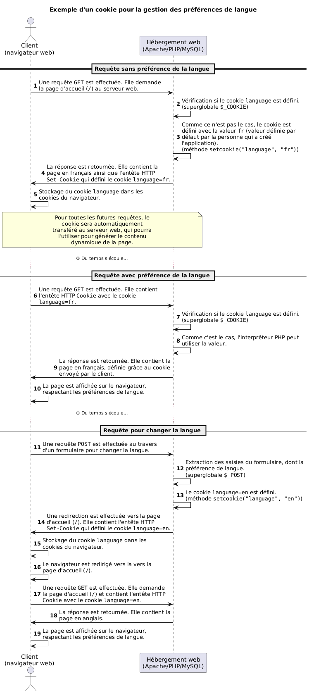
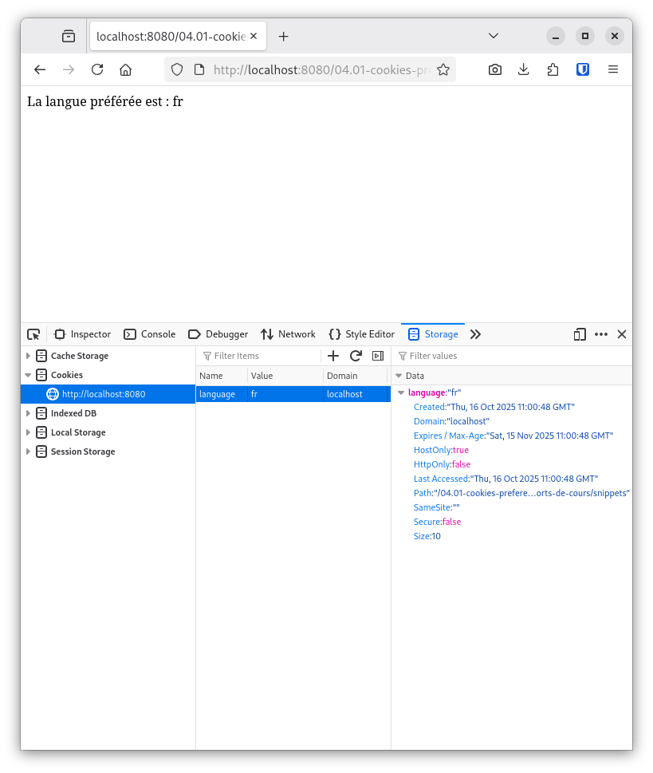

# Cookies, préférences, et gestion multilingues (i18n) - Support de cours

L. Delafontaine, avec l'aide de
[GitHub Copilot](https://github.com/features/copilot).

Ce travail est sous licence [CC BY-SA 4.0][licence].

## Ressources annexes

- Objectifs, méthodes d'enseignement et d'apprentissage, et méthodes
  d'évaluation : [Lien vers le contenu](..)
- Autres formes du support de cours :
  [Presentation (web)](https://heig-vd-progserv-course.github.io/heig-vd-progserv2-course/04.01-cookies-preferences-et-gestion-multilingues-i18n/01-supports-de-cours/index.html)
  ·
  [Presentation (PDF)](https://heig-vd-progserv-course.github.io/heig-vd-progserv2-course/04.01-cookies-preferences-et-gestion-multilingues-i18n/01-supports-de-cours/04.01-cookies-preferences-et-gestion-multilingues-i18n-presentation.pdf)
- Exemples de code : [Lien vers le contenu](../02-exemples-de-code/)
- Exercices : [Lien vers le contenu](../03-exercices/README.md)

## Table des matières

- [Ressources annexes](#ressources-annexes)
- [Table des matières](#table-des-matières)
- [Objectifs](#objectifs)
- [Les cookies](#les-cookies)
  - [Créer des cookies en PHP](#créer-des-cookies-en-php)
  - [Lire des cookies en PHP](#lire-des-cookies-en-php)
  - [Invalider/supprimer des cookies en PHP](#invalidersupprimer-des-cookies-en-php)
  - [Visualiser les cookies dans le navigateur](#visualiser-les-cookies-dans-le-navigateur)
- [Gestion multilingue (i18n)](#gestion-multilingue-i18n)
  - [Fichiers de traduction](#fichiers-de-traduction)
  - [Utilisation des fichiers de traduction](#utilisation-des-fichiers-de-traduction)
- [Conclusion](#conclusion)
- [Exemples de code](#exemples-de-code)
- [Exercices](#exercices)

## Objectifs

- Utiliser les cookies pour stocker les préférences des utilisateurs.
- Implémenter la gestion multilingue (i18n) dans une application web PHP.

## Les cookies

Les cookies sont de petits fichiers texte stockés sur le navigateur de
l'utilisateur.

Ils sont envoyés par le serveur web via l'en-tête HTTP `Set-Cookie` dans la
réponse HTTP. Automatiquement, le navigateur stocke le cookie et l'envoie de
nouveau au serveur avec chaque requête subséquente vers le même domaine. Le
serveur peut ainsi lire les cookies envoyés par le navigateur via l'en-tête HTTP
`Cookie` et adapter la réponse en fonction des informations contenues dans les
cookies.

Les cookies permettent d'y stocker diverses informations, telles que :

- Les préférences de langue.
- Les sessions de connexion.
- Les préférences de thème (clair/sombre).
- Les articles dans un panier d'achat.
- Les identifiants de suivi pour l'analyse web.
- Et bien d'autres choses encore.

Les cookies ont une date d'expiration, après laquelle ils sont automatiquement
supprimés par le navigateur. Ils peuvent être persistants (stockés sur le disque
dur jusqu'à leur expiration) ou de session (supprimés lorsque le navigateur est
fermé).

Il existe différentes options pour les cookies, telles que :

- Le domaine et le chemin pour lesquels le cookie est valide.
- La sécurité associée à ce cookie (cookie sécurisé, accessible/transmise
  uniquement via HTTPS par exemple).
- La durée de vie du cookie (expiration).
- L'attribut `HttpOnly` pour empêcher l'accès au cookie via JavaScript.
- Et quelques autres options que nous n'aborderons pas ici.

De ce fait, les cookies sont largement utilisés pour améliorer l'expérience
utilisateur sur les sites web.

Le diagramme ci-dessous illustre le processus de création et de lecture des
cookies entre le navigateur et le serveur pour la gestion des préférences de
langue :



### Créer des cookies en PHP

Les cookies ne sont pas spécifiques à PHP, mais PHP fournit des fonctions
pratiques pour les gérer.

Pour créer un cookie en PHP, on utilise la fonction `setcookie()`. Par exemple,
pour créer un cookie nommé `language` avec la valeur `fr` qui expire dans 30
jours :

```php
<?php
// Définit un cookie 'language'
// avec la valeur 'fr'
// qui expire dans 30 jours.
setcookie(
    'language',
    'fr',
    time() + (30 * 24 * 60 * 60)
);
```

La fonction `time()` retourne le timestamp Unix actuel (nombre de secondes
écoulées depuis le 1er janvier 1970). Cela permet de définir une date
d'expiration dans le futur en ajoutant le nombre de secondes souhaité. Pour plus
de détails, voir la documentation officielle de PHP pour `time()` disponible ici
: <https://www.php.net/manual/fr/function.time.php>.

Lorsque le navigateur va demander une page au serveur, le serveur pourra
retourner au client le cookie `language` avec la valeur `fr` dans l'en-tête HTTP
`Set-Cookie`.

Automatiquement, le navigateur stockera le cookie et l'enverra de nouveau au
serveur avec chaque requête subséquente vers le même domaine.

### Lire des cookies en PHP

Pour lire un cookie en PHP, on accède à la superglobale `$_COOKIE`. Par exemple,
pour lire la valeur du cookie `language` :

```php
<?php
// Vérifie si le cookie 'language' est défini.
if (isset($_COOKIE['language'])) {
    $language = $_COOKIE['language'];
    echo "La langue préférée est : " .
        htmlspecialchars($language);
} else {
    echo "Aucune langue préférée définie.";
}
```

Il est donc possible de lire la valeur du cookie `language` envoyé par le
navigateur via l'en-tête HTTP `Cookie`.

La fonction `setcookie()` doit être appelée avant tout envoi de contenu au
navigateur, sinon le cookie ne sera pas pris en compte (par exemple, avant tout
`echo` ou balise HTML).

Elle prend différents paramètres optionnels pour configurer le cookie, tels que
le domaine, le chemin, la durée de vie, et d'autres attributs de sécurité. La
documentation officielle de PHP pour `setcookie()` est disponible ici :
<https://www.php.net/manual/fr/function.setcookie.php>.

Grâce aux cookies, il est possible de personnaliser l'expérience utilisateur en
fonction des préférences stockées dans les cookies.

### Invalider/supprimer des cookies en PHP

Pour supprimer un cookie, il suffit de le recréer avec une valeur vide ou une
date d'expiration passée. Par exemple, pour supprimer le cookie `language` en
définissant une date d'expiration dans le passé :

```php
<?php
// Supprime le cookie en le recréant
// avec une date d'expiration dans le passé.
setcookie('language', '', time() - 3600);
```

Cela indique au navigateur de supprimer le cookie `language` en le recréant avec
une date d'expiration dans le passé. Lors de réception de la réponse, le
navigateur supprimera ce cookie. Lors de la prochaine requête , le navigateur
n'enverra plus ce cookie au serveur.

Une autre façon de supprimer un cookie est de le recréer avec une valeur vide,
sans spécifier de date d'expiration. Par exemple :

```php
<?php
// Supprime le cookie en lui
// donnant une valeur vide.
setcookie('language', '');
```

Lorsque le navigateur reçoit cette réponse, il supprimera le cookie `language`.

### Visualiser les cookies dans le navigateur

La plupart des navigateurs web modernes offrent des outils de développement qui
permettent de visualiser et de gérer les cookies stockés par le navigateur.

Accéder aux outils de développement dépend du navigateur utilisé. Voici comment
y accéder dans quelques navigateurs populaires :

- **Google Chrome** (et autres navigateurs basés sur Chromium, comme Microsoft
  Edge) :
  - Ouvrez le menu (trois points verticaux en haut à droite).
  - Allez dans "Plus d'outils" > "Outils de développement" ou appuyez sur
    `Ctrl+Shift+I` (Windows/Linux) ou `Cmd+Option+I` (Mac).
  - Allez dans l'onglet "Application".
  - Dans le panneau de gauche, sous "Stockage", cliquez sur "Cookies" pour voir
    les cookies stockés par le site web actuel.
- **Mozilla Firefox** :
  - Ouvrez le menu (trois lignes horizontales en haut à droite).
  - Allez dans "Développement web" > "Outils de développement" ou appuyez sur
    `Ctrl+Shift+I` (Windows/Linux) ou `Cmd+Option+I` (Mac).
  - Allez dans l'onglet "Stockage".
  - Dans le panneau de gauche, cliquez sur "Cookies" pour voir les cookies
    stockés par le site web actuel.
- **Safari** :
  - Allez dans "Safari" > "Préférences" > "Avancé".
  - Cochez la case "Afficher le menu Développement dans la barre de menus".
  - Allez dans "Développement" > "Afficher l'inspecteur Web" ou appuyez sur
    `Cmd+Option+I`.
  - Allez dans l'onglet "Stockage".
  - Dans le panneau de gauche, cliquez sur "Cookies" pour voir les cookies
    stockés par le site web actuel.

Les outils de développement permettent également de modifier ou de supprimer les
cookies existants, ce qui peut être utile pour le débogage et le test des
applications web.



## Gestion multilingue (i18n)

La gestion multilingue, ou i18n (internationalization - le terme _"i18n"_ vient
du fait qu'il y a 18 lettres entre le _"i"_ et le _"n"_ dans le mot anglais
_"internationalization"_), consiste à adapter une application pour qu'elle
puisse être utilisée dans plusieurs langues et cultures. Cela implique
généralement :

- La traduction des chaînes de caractères dans différentes langues.
- L'adaptation des formats de date, d'heure et de nombre en fonction des
  conventions locales.
- La gestion des contenus spécifiques à une culture (par exemple, des images ou
  des couleurs qui peuvent avoir des significations différentes selon les
  cultures).

De manière générale, la gestion multilingue dans une application web peut être
implémentée de plusieurs façons, notamment :

- Utilisation de fichiers de traduction.
- Utilisation de bases de données pour stocker les traductions.
- Utilisation de services externes pour la traduction.
- Utilisation de bibliothèques ou de frameworks qui facilitent la gestion des
  traductions.

### Fichiers de traduction

Dans le contexte de cette unité d'enseignement, nous allons utiliser des cookies
pour stocker les préférences de langue des utilisateurs et adapter le contenu de
l'application en fonction de ces préférences grâce à des fichiers de traduction
simples.

D'autres approches plus avancées existent, mais elles ne sont pas abordées dans
cette unité d'enseignement.

Une approche simple pour gérer la traduction des chaînes de caractères en PHP
consiste à utiliser des tableaux associatifs pour stocker les traductions. Par
exemple, on peut créer un fichier `translations.php` qui contient les
traductions pour différentes langues :

```php
<?php
// translations.php
$translations = [
    'en' => [
        'welcome' => 'Welcome',
        'hello' => 'Hello',
    ],
    'fr' => [
        'welcome' => 'Bienvenue',
        'hello' => 'Bonjour',
    ],
];
?>
```

### Utilisation des fichiers de traduction

Ensuite, dans le script principal, on peut lire la préférence de langue depuis
le cookie et utiliser le tableau de traductions pour afficher les chaînes dans
la langue préférée de l'utilisateur :

```php
<?php
require_once 'translations.php';

// Langue par défaut
const DEFAULT_LANGUAGE = 'en';

// Définit la langue par défaut
$language = DEFAULT_LANGUAGE;

// Vérifie si le cookie de langue est défini et valide
if (isset($_COOKIE['language']) && array_key_exists($_COOKIE['language'], $translations)) {
    // Si le cookie est défini et valide, utilise la langue du cookie
    $language = $_COOKIE['language'];
}

// Exemple d'utilisation
echo $translations[$language]['welcome'];
```

Cette approche permet de gérer facilement les traductions en fonction des
préférences de langue stockées dans les cookies.

Un exemple plus complet est disponible dans les exemples de code de cette unité
d'enseignement pour éviter d'avoir un seul fichier avec toutes les traductions
de toutes les langues.

## Conclusion

Dans ce cours, nous avons exploré l'utilisation des cookies pour stocker les
préférences des utilisateurs, ainsi que l'implémentation de la gestion
multilingue (i18n) dans une application web PHP.

Plusieurs approches existent pour gérer les préférences des utilisateurs et la
traduction des contenus, mais l'utilisation des cookies et des fichiers de
traduction est une méthode simple et efficace pour commencer.

## Exemples de code

Nous vous invitons maintenant à consulter les exemples de code du cours afin de
vous familiariser avec les concepts abordés.

Vous trouverez les exemples de code ici :
[Exemples de code](../02-exemples-de-code/).

## Exercices

Nous vous invitons ensuite à réaliser les exercices du cours afin de mettre en
pratique les concepts abordés.

Vous trouverez les exercices ici : [Exercices](../03-exercices/README.md).

[licence]:
	https://github.com/heig-vd-progserv-course/heig-vd-progserv2-course/blob/main/LICENSE.md
