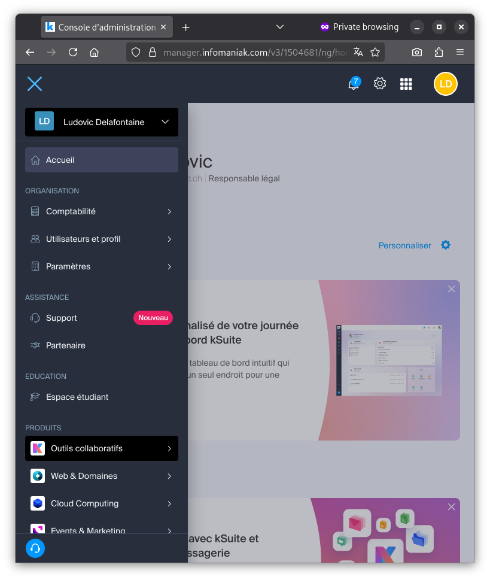
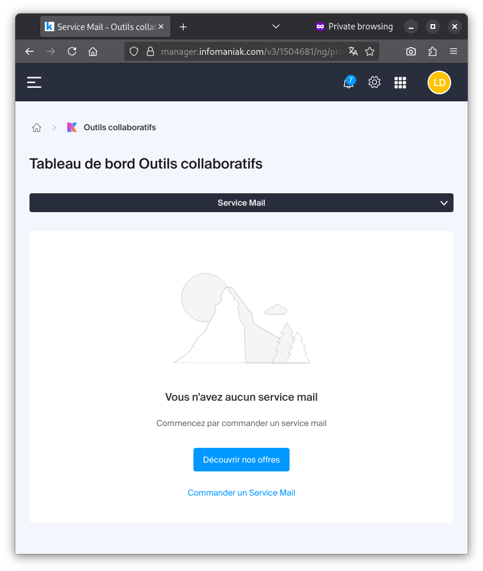
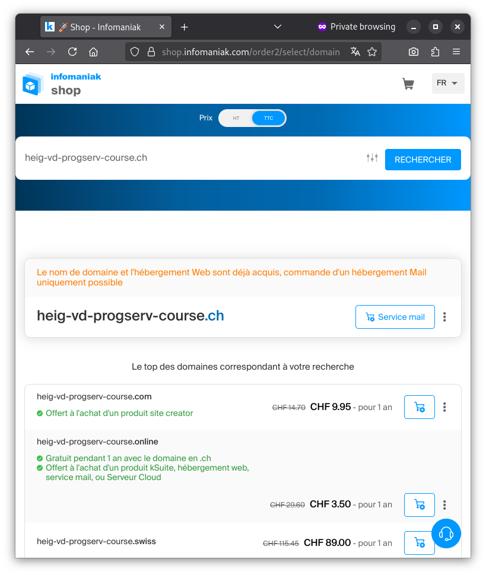
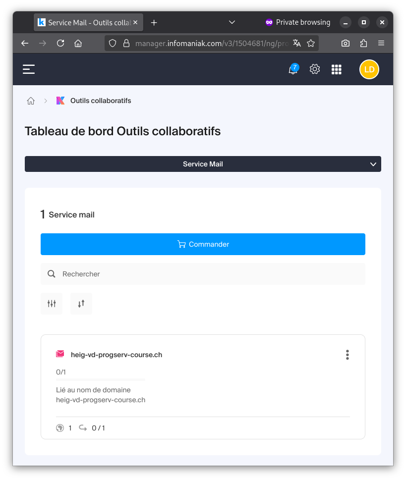
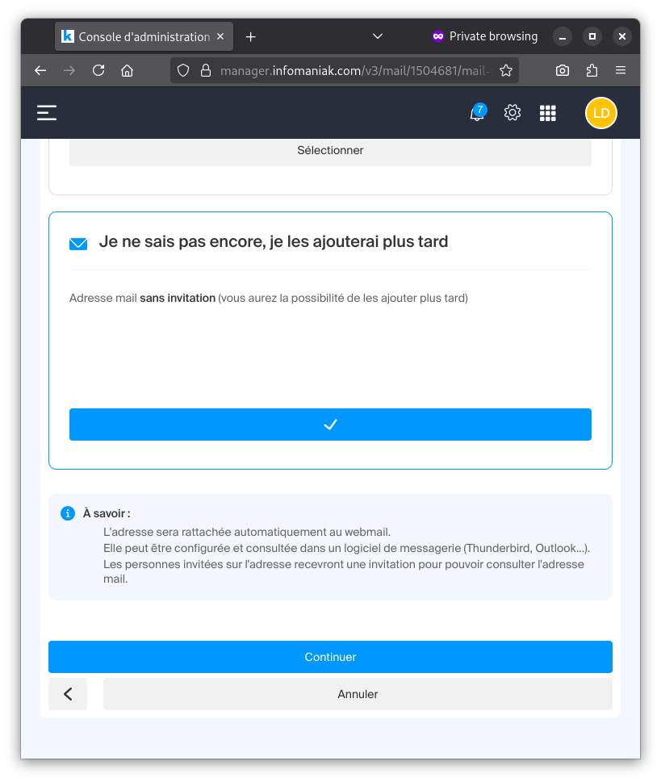
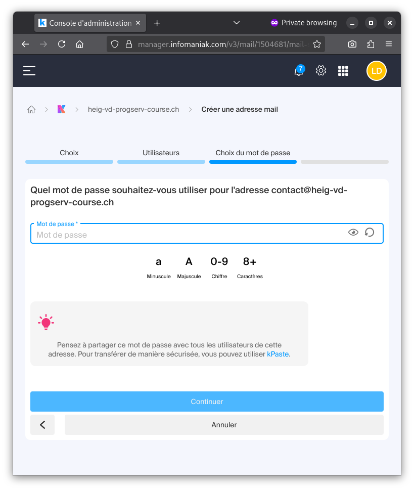
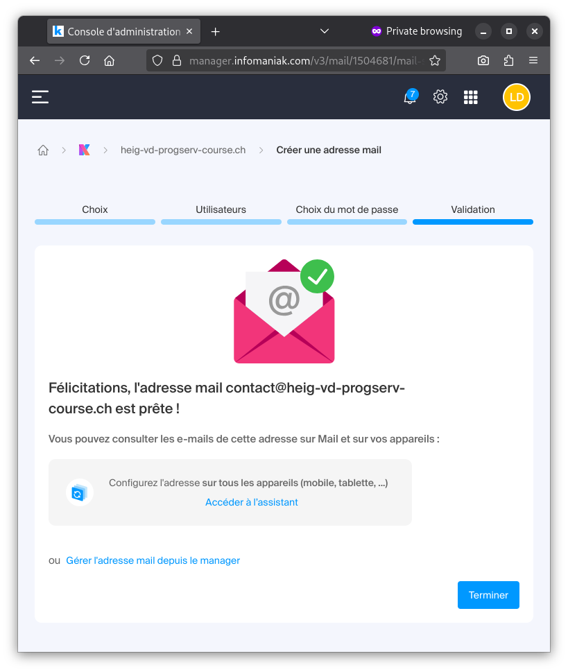
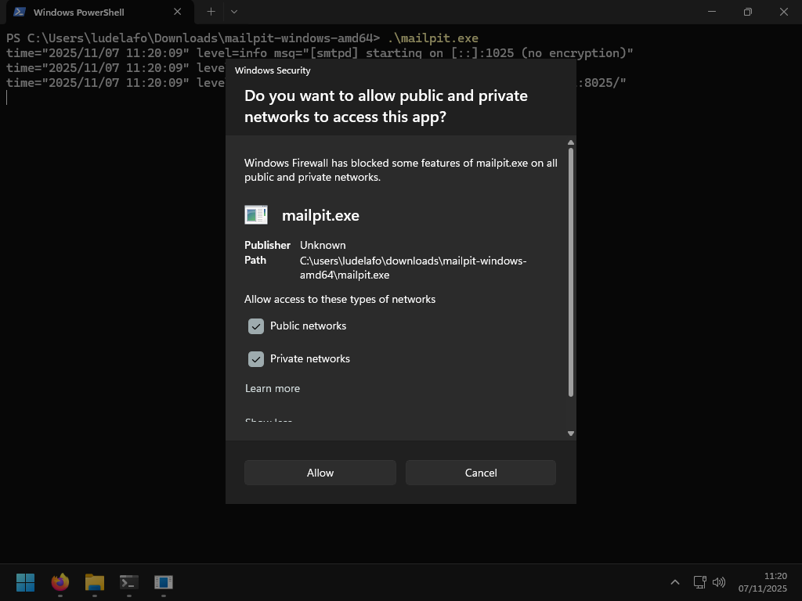
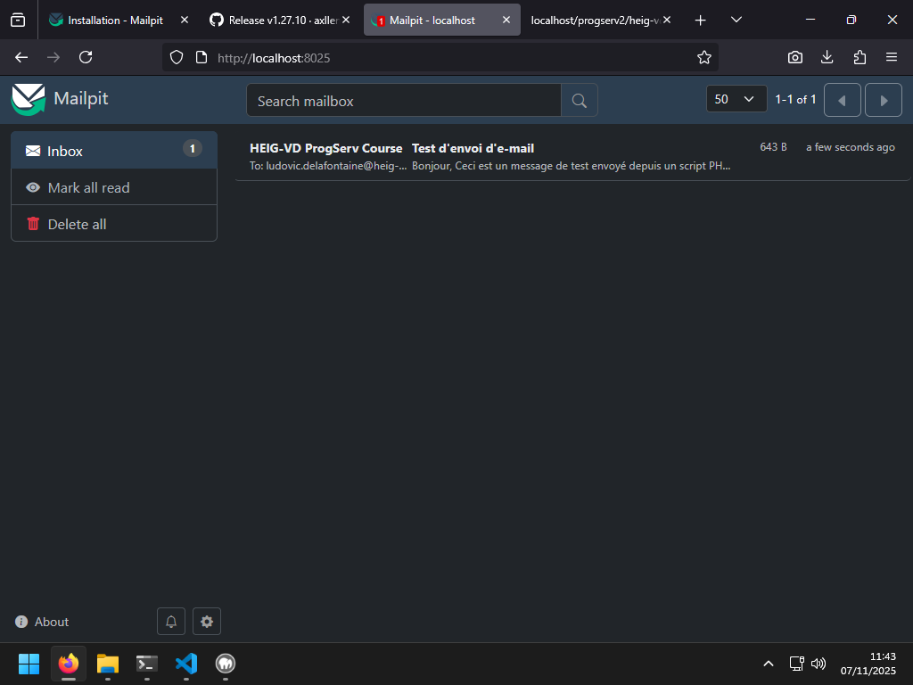

# Gestion et envoi des e-mails - Support de cours

L. Delafontaine, avec l'aide de
[GitHub Copilot](https://github.com/features/copilot).

Ce travail est sous licence [CC BY-SA 4.0][licence].

## Ressources annexes

- Objectifs, méthodes d'enseignement et d'apprentissage, et méthodes
  d'évaluation : [Lien vers le contenu](..)
- Autres formes du support de cours :
  [Presentation (web)](https://heig-vd-progserv-course.github.io/heig-vd-progserv2-course/06.01-gestion-et-envoi-des-e-mails/01-supports-de-cours/index.html)
  ·
  [Presentation (PDF)](https://heig-vd-progserv-course.github.io/heig-vd-progserv2-course/06.01-gestion-et-envoi-des-e-mails/01-supports-de-cours/06.01-gestion-et-envoi-des-e-mails-presentation.pdf)
- Exemples de code : [Lien vers le contenu](../02-exemples-de-code/)
- Exercices : [Lien vers le contenu](../03-exercices/README.md)

## Table des matières

- [Ressources annexes](#ressources-annexes)
- [Table des matières](#table-des-matières)
- [Objectifs](#objectifs)
- [Derrière les mails : SMTP, POP3 et IMAP](#derrière-les-mails--smtp-pop3-et-imap)
  - [SMTP (Simple Mail Transfer Protocol)](#smtp-simple-mail-transfer-protocol)
  - [POP3 (Post Office Protocol version 3)](#pop3-post-office-protocol-version-3)
  - [IMAP (Internet Message Access Protocol)](#imap-internet-message-access-protocol)
- [Fonctions et librairies pour envoyer des e-mails en PHP](#fonctions-et-librairies-pour-envoyer-des-e-mails-en-php)
  - [La fonction `mail()`](#la-fonction-mail)
  - [La bibliothèque PHPMailer](#la-bibliothèque-phpmailer)
- [Configurer son environnement pour envoyer des e-mails](#configurer-son-environnement-pour-envoyer-des-e-mails)
  - [Configurer son environnement de production](#configurer-son-environnement-de-production)
  - [Configuration son environnement de développement](#configuration-son-environnement-de-développement)
- [Envoyer des mails en PHP à l'aide de PHPMailer](#envoyer-des-mails-en-php-à-laide-de-phpmailer)
  - [Télécharger et installer PHPMailer](#télécharger-et-installer-phpmailer)
  - [Création du fichier de configuration `mail.ini`](#création-du-fichier-de-configuration-mailini)
  - [Utilisation de PHPMailer pour envoyer des e-mails](#utilisation-de-phpmailer-pour-envoyer-des-e-mails)
  - [Tester l'envoi d'e-mails](#tester-lenvoi-de-mails)
- [Conclusion](#conclusion)
- [Exemples de code](#exemples-de-code)
- [Exercices](#exercices)

## Objectifs

- Décrire les protocoles de messagerie électronique (SMTP, POP3, IMAP).
- Expliquer les différences entre la fonction `mail()` de PHP et les
  bibliothèques tierces pour l'envoi d'e-mails.
- Configurer un environnement local et un environnement de production pour
  l'envoi d'e-mails via SMTP.
- Utiliser la bibliothèque PHPMailer pour envoyer des e-mails en PHP.

## Derrière les mails : SMTP, POP3 et IMAP

Afin d'envoyer et recevoir des e-mails, plusieurs protocoles sont utilisés. Les
plus courants sont SMTP, POP3 et IMAP.

La plupart des clients de messagerie (comme Outlook, Thunderbird, etc.) et des
services de messagerie en ligne (comme Gmail, Outlook.com, etc.) utilisent ces
protocoles pour gérer les e-mails.

### SMTP (Simple Mail Transfer Protocol)

SMTP est le protocole standard pour l'envoi d'e-mails sur Internet. Il est
utilisé par les serveurs de messagerie pour transférer les e-mails d'un serveur
à un autre.

Lorsque vous envoyez un e-mail, votre client de messagerie utilise SMTP pour
transmettre le message au serveur de messagerie sortant, qui le relaie ensuite
au serveur de messagerie du destinataire.

Il est important de savoir que SMTP est un des premiers protocoles Internet
développés à une période où la sécurité n'était pas une priorité. Par
conséquent, le protocole SMTP de base n'offre pas d'authentification ni de
chiffrement et nécessite des extensions ou des configurations supplémentaires
pour assurer la sécurité.

De ce fait, il est parfois un peu plus complexe d'utiliser/de configurer un
serveur SMTP sécurisé par rapport à d'autres protocoles plus récents.

### POP3 (Post Office Protocol version 3)

POP3 est un protocole utilisé pour récupérer les e-mails depuis un serveur de
messagerie.

Contrairement à IMAP, POP3 télécharge les e-mails sur l'appareil local et les
supprime généralement du serveur. Cela signifie que les e-mails ne sont pas
synchronisés entre plusieurs appareils.

### IMAP (Internet Message Access Protocol)

IMAP est un protocole utilisé pour accéder aux e-mails stockés sur un serveur de
messagerie.

Contrairement à POP3, IMAP permet de gérer les e-mails directement sur le
serveur, ce qui signifie que les e-mails restent sur le serveur même après avoir
été lus. Cela permet de synchroniser les e-mails sur plusieurs appareils,
conservant ainsi leur état (lu, non lu, supprimé, etc.) sur tous les appareils.

## Fonctions et librairies pour envoyer des e-mails en PHP

Afin d'envoyer des e-mails en PHP, il est d'abord nécessaire de configurer un
serveur SMTP (= un serveur capable d'envoyer des e-mails).

Plusieurs options sont disponibles, telles que l'utilisation d'un serveur SMTP
fourni par un fournisseur de services de messagerie (comme Infomaniak, Gmail,
Outlook, etc.) ou la configuration d'un serveur SMTP dédié.

Une fois le serveur SMTP configuré, vous pouvez utiliser PHP pour envoyer des
e-mails.

Avec PHP, il y a plusieurs façons d'envoyer des e-mails via SMTP :

1. Utiliser la fonction intégrée `mail()` de PHP.
2. Utiliser une bibliothèque tierce comme
   [PHPMailer](https://github.com/PHPMailer/PHPMailer).

### La fonction `mail()`

La fonction `mail()` de PHP permet d'envoyer des e-mails, mais elle ne gère pas
directement SMTP. Elle dépend de la configuration du serveur web pour l'envoi
des e-mails.

Cela implique que vous devez installer et configurer un serveur de messagerie
sur le serveur web, ce qui peut être complexe et limité en fonctionnalités.

Ensuite, la fonction `mail()` va demander au serveur de messagerie local
d'envoyer l'e-mail en utilisant SMTP. Son utilisation est la suivante :

```php
<?php
$from = "no-reply@example.com";
$to = "ludovic.delafontaine@heig-vd.ch";
$subject = "Test d'envoi d'e-mail";
$body = "Ceci est un test d'envoi d'e-mail en PHP.";

$headers = "From: $from";

mail($to, $subject, $body, $headers);
```

De plus, la fonction `mail()` ne supporte pas nativement l'authentification SMTP
(liée aux raisons de sécurité mentionnées précédemment), ce qui peut poser des
problèmes de sécurité et de fiabilité.

Pour ces raisons, des personnes ont développé des bibliothèques PHP comme
[PHPMailer](https://github.com/PHPMailer/PHPMailer) pour faciliter l'envoi
d'e-mails via SMTP avec des fonctionnalités avancées telles que
l'authentification, le chiffrement, et la gestion des pièces jointes, etc.

### La bibliothèque PHPMailer

[PHPMailer](https://github.com/PHPMailer/PHPMailer) est une bibliothèque PHP
populaire qui facilite l'envoi d'e-mails via SMTP.

> [!NOTE]
>
> Une bibliothèque est un ensemble de fonctions et de classes pré-écrites que
> vous pouvez utiliser dans votre propre code pour accomplir des tâches
> spécifiques sans avoir à les coder vous-même.

PHPMailer offre plusieurs avantages par rapport à la fonction `mail()` de PHP,
notamment (entre autres) :

- Support natif de l'authentification SMTP.
- Support du chiffrement TLS/SSL pour sécuriser les communications.
- Gestion facile des pièces jointes.
- Support des e-mails HTML et texte brut.
- Etc.

De ce fait, PHPMailer est largement utilisé dans les applications PHP pour
envoyer des e-mails de manière fiable et sécurisée.

## Configurer son environnement pour envoyer des e-mails

Afin de pouvoir envoyer des e-mails, il est nécessaire de configurer
l'environnement de production et de développement pour utiliser un serveur SMTP.

Suivez les étapes ci-dessous pour configurer votre environnement :

- [Configurer son environnement de production](#configurer-son-environnement-de-production)
- [Configuration son environnement de développement](#configuration-son-environnement-de-développement)

### Configurer son environnement de production

> [!NOTE]
>
> Nous vous conseillons d'abord de configurer votre environnement de production,
> de tester l'envoi d'e-mails depuis celui-ci, puis de configurer votre
> environnement de développement en conséquence :
>
> 1. [Configurer son environnement de production](#configurer-son-environnement-de-production)
> 2. [Envoyer des mails en PHP à l'aide de PHPMailer](#envoyer-des-mails-en-php-à-laide-de-phpmailer)
> 3. [Configuration son environnement de développement](#configuration-son-environnement-de-développement)
>
> Cela vous permettra de vous assurer que tout fonctionne correctement avant de
> passer à l'environnement de développement.

Dans le contexte d'un environnement de production, il est crucial de configurer
correctement le serveur SMTP pour garantir la fiabilité et la sécurité de
l'envoi des e-mails.

Dans le contexte de cette unité d'enseignement, nous utilisons Infomaniak comme
hébergeur web. Vous avez déjà, dans le contexte d'un précédent cours, commandé
et configuré un :

- Nom de domaine.
- Hébergement web.

Pour envoyer des e-mails, il est encore nécessaire d'acquérir un service de
messagerie auprès d'Infomaniak.

Les étapes suivantes décrivent comment acquérir et configurer un service de
messagerie avec une adresse e-mail personnalisée liée à votre nom de domaine.

#### Acquérir un service de messagerie

Connectez-vous à votre compte Infomaniak à l'aide de votre adresse e-mail
HEIG-VD et du mot de passe associé.

Accédez au service mail d'Infomaniak en accédant au menu **"Outils
collaboratifs"** > **"Service Mail"**.

<details>
<summary>Cliquer ici pour voir des captures d'écran illustrant les étapes</summary>




</details>

Cliquez sur le lien **"Commander un Service Mail"**.

<details>
<summary>Cliquer ici pour voir une capture d'écran illustrant l'étape</summary>



</details>

Vous serez redirigé vers le shop d'Infomaniak. Saisissez le nom de domaine que
vous aviez précédemment commandé, puis cliquez sur le bouton **"Rechercher"**.
Infomaniak identifiera automatiquement que le nom de domaine est déjà associé à
votre compte et que vous pourrez commander un service de messagerie pour ce
domaine.

<details>
<summary>Cliquer ici pour voir une capture d'écran illustrant l'étape</summary>



</details>

Sélectionnez le plan de messagerie gratuit, incluant une adresse e-mail, puis
cliquez sur le bouton **"Suivant"**. Validez ensuite votre commande en suivant
les instructions à l'écran.

<details>
<summary>Cliquer ici pour voir une capture d'écran illustrant l'étape</summary>


</details>

Une fois la commande validée, vous pourrez créer une adresse e-mail
personnalisée associée à votre nom de domaine en retournant dans le service mail
d'Infomaniak.

<details>
<summary>Cliquer ici pour voir une capture d'écran illustrant l'étape</summary>




</details>

Ajoutez une nouvelle adresse e-mail en cliquant sur le service mail associé à
votre nom de domaine, puis en cliquant sur le bouton **"Créer une adresse
e-mail"**.

<details>
<summary>Cliquer ici pour voir une capture d'écran illustrant l'étape</summary>


</details>

Choisissez l'adresse e-mail que vous souhaitez créer (par exemple
`contact@ votredomaine.ch`, `info@votredomaine.ch`, `support@votredomaine.ch`,
`admin@votredomaine.ch`, etc.), puis définissez un mot de passe sécurisé. Notez
le mot de passe quelque part, vous en aurez besoin par la suite.

<details>
<summary>Cliquer ici pour voir une capture d'écran illustrant l'étape</summary>









</details>

Vous avez acquis une adresse e-mail personnalisée associée à votre nom de
domaine.

#### Utiliser l'adresse e-mail dans votre application PHP

Vous pouvez maintenant utiliser cette adresse e-mail pour envoyer et recevoir
des e-mails via votre application PHP en suivant les étapes décrites dans la
section
[Envoyer des mails en PHP à l'aide de PHPMailer](#envoyer-des-mails-en-php-à-laide-de-phpmailer).

### Configuration son environnement de développement

> [!NOTE]
>
> Nous vous conseillons d'abord de configurer votre environnement de production,
> de tester l'envoi d'e-mails depuis celui-ci, puis de configurer votre
> environnement de développement en conséquence :
>
> 1. [Configurer son environnement de production](#configurer-son-environnement-de-production)
> 2. [Envoyer des mails en PHP à l'aide de PHPMailer](#envoyer-des-mails-en-php-à-laide-de-phpmailer)
> 3. [Configuration son environnement de développement](#configuration-son-environnement-de-développement)
>
> Cela vous permettra de vous assurer que tout fonctionne correctement avant de
> passer à l'environnement de développement.

Dans le contexte d'un environnement de développement, il est souvent préférable
d'utiliser un serveur SMTP local ou un service de messagerie dédié au
développement pour éviter d'envoyer des e-mails réels pendant les tests.

Une option populaire pour le développement local est
[Mailpit](https://github.com/axllent/mailpit).

Mailpit est un serveur SMTP local qui capture les e-mails envoyés par votre
application sans les envoyer réellement. Cela vous permet de tester l'envoi
d'e-mails sans risquer d'envoyer des e-mails non désirés à de vrais
destinataires.

Mailpit est un outil open-source, qui offre une interface web conviviale pour
visualiser et gérer les e-mails capturés.

Son utilisation se fait en ligne de commande. Il est donc nécessaire de le
lancer au travers d'un terminal, avant d'exécuter votre application PHP.

L'exécution d'une application au travers du terminal peut être différente selon
le système d'exploitation utilisé (Windows, Linux, macOS, etc.) et peut être
intimidante la première fois. Les étapes suivantes vous guideront à travers le
processus.

Pour configurer Mailpit dans votre environnement de développement, suivez les
étapes ci-dessous.

#### Télécharger Mailpit

Pour installer Mailpit, suivez les étapes ci-dessous :

1. Rendez-vous sur la page GitHub de Mailpit :
   <https://github.com/axllent/mailpit>.
2. Dans le menu de droite, accédez aux releases en cliquant sur le lien
   **"Releases"** : <https://github.com/axllent/mailpit/releases>.
3. Utiliser la version 1.27.11 de Mailpit (ou une version ultérieure si
   disponible) puis cliquez dessus pour accéder à la page de la release.
4. Sous la section **"Assets"**, téléchargez l'archive ZIP correspondant à votre
   système d'exploitation :
   - `mailpit-windows-amd64.zip` pour Windows
   - `mailpit-darwin-amd64.tar.gz` pour macOS sur processeur Intel/AMD
   - `mailpit-darwin-arm64.tar.gz` pour macOS sur processeur Apple Silicon
     (M1/M2/M3/M4)
   - `mailpit-linux-amd64.tar.gz` pour Linux sur processeur Intel/AMD
5. Extrayez le contenu de l'archive ZIP ou TAR.GZ dans un répertoire de votre
   choix (le dossier _"Téléchargements"_, par exemple). L'archive ne devrait
   contenir qu'un seul fichier exécutable nommé `mailpit` (ou `mailpit.exe` sous
   Windows).

#### Lancer Mailpit

Afin de lancer Mailpit, ouvrez un terminal (Invite de commandes sous Windows,
Terminal sous macOS ou Linux) et naviguez jusqu'au répertoire où vous avez
extrait le fichier exécutable `mailpit`.

> [!TIP]
>
> Sous Windows, vous pouvez maintenir la touche `Shift` enfoncée, puis faire un
> clic droit dans le dossier où se trouve le fichier `mailpit.exe`. Dans le menu
> contextuel, sélectionnez l'option **"Ouvrir une fenêtre PowerShell ici"** pour
> ouvrir le terminal directement dans ce répertoire.
>
> <details>
> <summary>Cliquer ici pour voir une capture d'écran illustrant l'étape</summary>
>
> 
>
> </details>

Lancez Mailpit en exécutant la commande suivante dans le terminal :

```powershell
# Pour les personnes utilisant Windows
.\mailpit.exe
```

ou

```bash
# Pour les personnes utilisant macOS ou Linux
./mailpit
```

Lors de l'exécution de la commande, vous devriez voir des messages dans le
terminal indiquant que Mailpit a démarré avec succès. Il se peut que votre
système d'exploitation vous demande d'autoriser Mailpit à accéder au réseau.
Acceptez cette demande pour permettre à Mailpit de fonctionner correctement.

<details>
<summary>Cliquer ici pour voir une capture d'écran illustrant l'étape</summary>




</details>

Mailpit devrait maintenant être en cours d'exécution. Par défaut, Mailpit écoute
sur le port SMTP `1025` pour recevoir les e-mails et sur le port `8025` pour
l'interface web.

Ouvrez votre navigateur web et accédez à l'URL suivante pour ouvrir l'interface
web de Mailpit : <http://localhost:8025>.

Une fenêtre devrait s'ouvrir affichant l'interface web de Mailpit, où vous
pourrez visualiser les e-mails capturés :



#### Utiliser Mailpit avec votre application PHP

Comme Mailpit est un serveur SMTP fictif et local, les e-mails envoyés via
Mailpit ne seront pas réellement envoyés à de vrais destinataires. Ils seront
capturés par Mailpit et affichés dans son interface web pour que vous puissiez
les visualiser et les tester.

Une fois Mailpit arrêté (en fermant le terminal ou en interrompant le processus
à l'aide d'un raccourci clavier comme `Ctrl+C`), tous les e-mails capturés
seront perdus.

De plus, Mailpit doit être en cours d'exécution chaque fois que vous souhaitez
tester l'envoi d'e-mails depuis votre application PHP. Aucune authentification
n'est requise pour utiliser Mailpit, car il est destiné uniquement au
développement local. Vous pouvez donc configurer votre application PHP pour
utiliser Mailpit sans fournir de nom d'utilisateur ou de mot de passe.

Vous pouvez maintenant utiliser Mailpit pour envoyer et recevoir des e-mails via
votre application PHP en suivant les étapes décrites dans la section
[Envoyer des mails en PHP à l'aide de PHPMailer](#envoyer-des-mails-en-php-à-laide-de-phpmailer).

## Envoyer des mails en PHP à l'aide de PHPMailer

Les étapes suivantes décrivent comment envoyer des e-mails en PHP à l'aide de la
librairie [PHPMailer](https://github.com/PHPMailer/PHPMailer).

> [!TIP]
>
> Les étapes suivantes utilisent les exemples de code mentionnés dans la section
> [Exemples de code](#exemples-de-code) de ce cours.

### Télécharger et installer PHPMailer

> [!TIP]
>
> La méthode recommandée pour installer PHPMailer est d'utiliser
> [Composer](https://getcomposer.org/), le gestionnaire de dépendances pour PHP.
>
> Comme nous n'avons pas étudié Composer dans le cadre de cette unité
> d'enseignement, nous allons utiliser une méthode manuelle pour installer
> PHPMailer.

Pour installer PHPMailer manuellement, suivez les étapes ci-dessous :

1. Rendez-vous sur la page GitHub de PHPMailer :
   <https://github.com/PHPMailer/PHPMailer>.
2. Dans le menu de droite, accédez aux releases en cliquant sur le lien
   **"Releases"** : <https://github.com/PHPMailer/PHPMailer/releases>.
3. Utilisez la version 7.0.0 de PHPMailer (ou une version ultérieure si
   disponible) puis cliquez dessus pour accéder à la page de la release.
4. Sous la section **"Assets"**, cliquez sur le lien **"Source code (zip)"**
   pour télécharger l'archive ZIP contenant les fichiers de la bibliothèque de
   la version liée à la release choisie.
5. Extrayez le contenu de l'archive ZIP dans un répertoire de votre choix (le
   dossier _"Téléchargements"_, par exemple).
6. Copiez le **contenu** du dossier `src` extrait dans le répertoire de votre
   projet PHP dans le dossier `src/classes/PHPMailer/PHPMailer` (notez le double
   `PHPMailer` dans le chemin, ce n'est pas une erreur de frappe).

La structure de votre projet devrait ressembler à ceci :

```text
./
├── public/
│   └── index.php
└── src/
    ├── classes/
    │   └── PHPMailer/
    │       └── PHPMailer/
    │           ├── DSNConfigurator.php
    │           ├── Exception.php
    │           ├── OAuth.php
    │           ├── OAuthTokenProvider.php
    │           ├── PHPMailer.php
    │           ├── POP3.php
    │           └── SMTP.php
    └── utils/
        └── autoloader.php
```

Notez l'utilisation d'un autoloader pour charger automatiquement les classes
PHP, comme celui que nous avons créé dans le cours
[Programmation orientée (avancé)](../../01.02-programmation-orientee-objet-avance/).

Prenez quelques minutes pour examiner les fichiers de la bibliothèque PHPMailer.
Remarquez-vous des éléments intéressants que nous aurions vus dans les cours
précédents ?

### Création du fichier de configuration `mail.ini`

Créez ensuite un fichier de configuration pour stocker les informations de
connexion au serveur SMTP.

Par exemple, créez un fichier `mail.ini` dans le répertoire `src/config/`, comme
étudié dans le cours
[Bases de données et PDO (avancé)](../../02.01-bases-de-donnees-et-pdo-avance/).

Utilisez les informations de connexion SMTP en fonction de votre environnement
(en remplaçant les valeurs par vos propres informations) :

- [Infoaniak (production)](#infomaniak-production)
- [Mailpit (développement)](#mailpit-développement)

#### Infomaniak (production)

> [!NOTE]
>
> La documentation officielle d'Infomaniak pour l'envoi de e-mails est
> disponible ici :
>
> - <https://www.infomaniak.com/en/support/faq/2023/use-authenticated-email-sending-from-a-website>
> - <https://www.infomaniak.com/en/support/faq/576/using-phpmailer-on-infomaniak>
> - <https://www.infomaniak.com/en/support/faq/2150/use-unauthenticated-not-recommended-email-sending-from-a-website>

```ini
host = "mail.infomaniak.com"
port = 465
authentication = true
username = "contact@heig-vd-progserv-course.ch"
password = "************"
from_email = "no-reply@heig-vd-progserv-course.ch"
from_name = "HEIG-VD ProgServ Course"
```

#### Mailpit (développement)

```ini
host = "localhost"
port = 1025
authentication = false
username = ""
password = ""
from_email = "no-reply@mailpit.localhost"
from_name = "Mailpit Local SMTP"
```

### Utilisation de PHPMailer pour envoyer des e-mails

Votre structure de projet devrait maintenant ressembler à ceci :

```text
./
├── public/
│   └── index.php
└── src/
    ├── classes/
    │   └── PHPMailer/
    │       └── PHPMailer/
    │           ├── DSNConfigurator.php
    │           ├── Exception.php
    │           ├── OAuth.php
    │           ├── OAuthTokenProvider.php
    │           ├── PHPMailer.php
    │           ├── POP3.php
    │           └── SMTP.php
    ├── config/
    │   └── mail.ini
    └── utils/
        └── autoloader.php
```

Puis, finalement, dans votre code PHP, utilisez PHPMailer pour envoyer des
e-mails avec, par exemple, le fichier `public/index.php` suivant :

```php
<?php
require_once __DIR__ . '/../src/utils/autoloader.php';

use PHPMailer\PHPMailer\PHPMailer;
use PHPMailer\PHPMailer\Exception;

const MAIL_CONFIGURATION_FILE = __DIR__ . '/../src/config/mail.ini';

$config = parse_ini_file(MAIL_CONFIGURATION_FILE, true);

if (!$config) {
   throw new Exception("Erreur lors de la lecture du fichier de configuration : " .
         MAIL_CONFIGURATION_FILE);
}

$host = $config['host'];
$port = filter_var($config['port'], FILTER_VALIDATE_INT);
$authentication = filter_var($config['authentication'], FILTER_VALIDATE_BOOLEAN);
$username = $config['username'];
$password = $config['password'];
$from_email = $config['from_email'];
$from_name = $config['from_name'];

$mail = new PHPMailer(true);

try {
    $mail->isSMTP();
    $mail->Host = $host;
    $mail->Port = $port;
    $mail->SMTPAuth = $authentication;
    $mail->Username = $username;
    $mail->Password = $password;
    $mail->CharSet = "UTF-8";
    $mail->Encoding = "base64";

    // Expéditeur et destinataire
    $mail->setFrom($from_email, $from_name);
    $mail->addAddress('CHANGE_ME', 'CHANGE WITH YOUR NAME');

    // Contenu du mail
    $mail->isHTML(true);
    $mail->Subject = 'Here is the subject';
    $mail->Body    = 'This is the HTML message body <b>in bold!</b>';
    $mail->AltBody = 'This is the body in plain text for non-HTML mail clients';

    $mail->send();

    echo 'Message has been sent';
} catch (Exception $e) {
    echo "Message could not be sent. Mailer Error: {$mail->ErrorInfo}";
}
```

### Tester l'envoi d'e-mails

Exécutez le script PHP depuis votre navigateur web (soit localement depuis votre
environnement de développement, soit en ligne depuis votre environnement de
production) et vérifiez que l'e-mail a bien été envoyé et reçu dans votre boîte
de réception ou dans l'interface web de Mailpit si vous utilisez Mailpit en
local.

Félicitations ! Vous venez d'envoyer un e-mail en PHP à l'aide de la librairie
PHPMailer.

## Conclusion

Au travers de ce dernier cours de l'unité d'enseignement, vous avez acquis les
compétences nécessaires pour intégrer la fonctionnalité d'envoi d'e-mails dans
vos applications PHP, ce qui est une compétence essentielle pour de nombreux
projets web.

Nous avons couvert les protocoles de messagerie électronique tels que SMTP, POP3
et IMAP, ainsi que les différences entre la fonction `mail()` de PHP et les
bibliothèques tierces comme PHPMailer.

Nous avons également appris à configurer un environnement de production et de
développement pour l'envoi d'e-mails via SMTP, et à utiliser PHPMailer pour
envoyer des e-mails de manière fiable et sécurisée.

De plus, vous avez découvert l'utilisation de bibliothèques tierces en PHP,
développées par des personnes tout autant passionnées que vous par leur domaine,
ce qui vous permet d'étendre les fonctionnalités de vos applications en
réutilisant du code déjà écrit et testé.

Dans de futures unités d'enseignement, vous aurez l'occasion d'utiliser d'autres
librairies tierces pour implémenter d'autres fonctionnalités avancées dans vos
applications PHP.

## Exemples de code

Nous vous invitons maintenant à consulter les exemples de code du cours afin de
vous familiariser avec les concepts abordés.

Vous trouverez les exemples de code ici :
[Exemples de code](../02-exemples-de-code/).

## Exercices

Nous vous invitons ensuite à réaliser les exercices du cours afin de mettre en
pratique les concepts abordés.

Vous trouverez les exercices ici : [Exercices](../03-exercices/README.md).

[licence]:
	https://github.com/heig-vd-progserv-course/heig-vd-progserv2-course/blob/main/LICENSE.md
